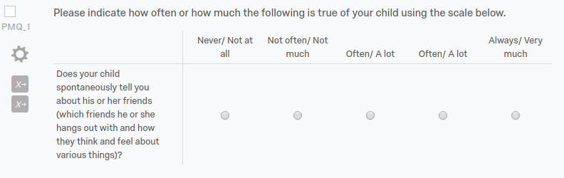

_Note well:_ Although this script scores and documents descriptive statistics about each measure used in TDS, it is intended as (1) a demonstration of how you can use various tools to easily download and score data from qualtrics, and (2) a first pass description of the data to be used to highlight any major data quality red flags. It generates scored scale output that one might use as input for some analyses, but these data should be checked and double checked to ensure that they are correct (which means that, yes, you should probably go back and rescore anything you're really counting on from the raw data and ensure that it is a reliable and valid measure). This is especially true for scales that are not created in the psychometric tradition (e.g., PAL-2, RSQ).

**This is a living document**, meaning that you can and should edit it as you need to (and git commit often)! If you need a hand understanding something, or get stuck, email [flournoy@uoregon.edu](mailto:flournoy@uoregon.edu).

This document will take a highly modular approach so that hopefully if something goes wrong, you can see more exactly where that happens. I'll try to explain every step pretty verbosely too. You should probably be reading this document in R Studio, running each chunk as you go. Make sure you're up to date with upgrades for R, R Studio, and packages.

hi im jack :) 

## Setting options

If you're reading the compiled HTML, you won't see the options below, because we've written `warning=F,echo=F,message=F,error=F` in the head of the chunk. You can change this by replacing the "F"s with "T"s. This chunk sets variables that will be reused to define where output goes, how it's named, what codes are used for gender in the PDS and so on.

```{r warning=F,echo=F,message=F,error=F}
knitr::opts_chunk$set(error = T, warning = T, message = F, fig.width = (11-3), fig.height = (8.5-1)/2)

#Set these options for your situation:

cred_file_location <- '~/.teenstudytoken'
pid_column_name <- 'SID'
age_var <- 'Age'
gender_var <- 'Gender'
gender_female <- 1 # value for female
gender_male <- 0 # value for male
pdss_gender_code <- c(m=gender_male, f=gender_female)
pdss_gender_mix <- 'mf' #'mf' for both M and F, 'm' for M only, 'f' for F only
exclude_SID <- c('', '999') # subject IDs to exclude
identifiableData <- '(DOB|Ethnicity|Work|Grade|School|TEXT|Addl_Probs|Reasons|Decribe|Concerns|BestThings|Describe|Started|Ended)' # exclude when printing duplicates
output_file_dir <- '/data/jflournoy/TDS/behavior/scored_qualtrics_data/'
tds2_wave1_rubric_dir <- '~/code_new/TDS_scripts/behavioral/score_qualtrics_tds/rubrics/tds2/wave1/'
tds2_wave2_rubric_dir <- '~/code_new/TDS_scripts/behavioral/score_qualtrics_tds/rubrics/tds2/wave2/'
tds1_wave1_rubric_dir <- '~/code_new/TDS_scripts/behavioral/score_qualtrics_tds/rubrics/tds1/wave1/post/'
tds1_wave1_rubric_dir_pre <- '~/code_new/TDS_scripts/behavioral/score_qualtrics_tds/rubrics/tds1/wave1/pre/'
tds1_wave2_rubric_dir <- '~/code_new/TDS_scripts/behavioral/score_qualtrics_tds/rubrics/tds1/wave2/'
TDS1_name <- 'tds1'
TDS2_name <- 'tds2'
wave1_name <- 'wave1'
wave2_name <- 'wave2'
```

## Install the `scorequaltrics` package

We need to have the scorequaltrics package installed. I wrote this so that I can maintain helpful functions related to scoring.

```{r eval = F}
#this chunk won't evaluate. If you need to 
#install the package, run this by hand.
devtools::install_github('jflournoy/qualtrics')
```

## Accessing qualtrics data

You also need to have a token in a YAML formatted file for accessing Qualtrics via the API. It's formatted like:

```
user: username
token: apitoken
```

Once we've loaded this, we can get a list of questionnaires.

```{r message=F, warning=F}
library(scorequaltrics)
library(ggplot2)
library(dplyr)
library(tidyr)

credentials <- scorequaltrics::creds_from_file(cred_file_location)

rawSurveys <- scorequaltrics::get_surveys(credentials)
rawSurveysTDS <- filter(rawSurveys, grepl('.*(TDS1|TDS2|TDS3).*',SurveyName))

knitr::kable(arrange(select(rawSurveysTDS, SurveyName), SurveyName))
```

We have a lot of different questionnaires from different samples and different sessions. For simplicity, and to aid in diagnosing any problems, we can proceed through each sample and each wave of data collection. _Note_, however, that if we ensured that naming conventions were consistent across all questionnaires and rubrics, and if we had accurate session dates attached, we could score everything in one fell swoop.

## Cleaning and scoring data

As an example, I'll walk through step-by-step how to clean and score data using the TDS2, Wave 1 sample.

This is the first sample collected, so we can begin here. I'll demonstrate in this how to do a single massive data scoring. Following that, I'll demonstrate how you can get more information about scales that have been constructed in a psychometric tradition, and that therefore are easy to evaluate using standard reliability metrics.

First, we download the data for the surveys we want.

```{r getsurveydata_tds2_wave1}
tds2_wave1_surveys <- rawSurveysTDS %>%
    filter(grepl('TDS2 (Session [12]|CBCL)', SurveyName))

print(tds2_wave1_surveys$SurveyName)

tds2_wave1_long <- scorequaltrics::get_survey_data(tds2_wave1_surveys, 
                                                   credentials, 
                                                   pid_col = pid_column_name)
dim(tds2_wave1_long)
names(tds2_wave1_long)
```

The resulting data frame should have a lot of rows (the first part of the output of `dim`) and 4 columns.

```{r echo = 'asis', echo = F}
#this chunk will not display in the compiled document, but it will
#echo text that will be displayed in the final document if something
#is wrong (or right).
if(all(dim(tds2_wave1_long)[1] > 500, dim(tds2_wave1_long)[2] == 4)){
    cat(paste0('It looks like all is in order here. Note that the PID column is named "', names(tds2_wave1_long)[1], '".'))
} else {
    cat('Something is wrong though. Dang.')
}
```

Note that some participants re-did their PDS questionnaires at wave 1, session 2, if it had been a long time since wave 1, session 1. We'll have to deal with these participants' PDS scores separately, and so we'll download that session 2 PDS data separately, and then replace the PDS in the main data file for PDS session 1 for anyone who has it from session 2.

```{r tds2w1_replacepdssession2}
tds2_wave1_surveys_pds2 <- rawSurveysTDS %>%
    filter(grepl('TDS2 - PDS \\(Session 2\\)', SurveyName))
tds2_wave1_long_pds2 <- scorequaltrics::get_survey_data(tds2_wave1_surveys_pds2, 
                                                        credentials, 
                                                        pid_col = pid_column_name) %>%
    filter(grepl('PDS', item))

tds2_wave1_sid_with_pds2 <- tds2_wave1_long_pds2 %>%
    group_by(SID) %>%
    summarize(n_items = sum(!is.na(as.numeric(value)))) %>%
    filter(n_items > 0) %>%
    select(SID) %>%
    unlist

tds2_wave1_long <- tds2_wave1_long %>%
    filter(!(grepl('PDS', item) & 
                 SID %in% tds2_wave1_sid_with_pds2)) %>% # remove PDS items from pds 
                                                         # session 2 participants
    bind_rows(filter(tds2_wave1_long_pds2, 
                     SID %in% tds2_wave1_sid_with_pds2)) # Add rows from PDS session 2
                                                         # participants, given that they're
                                                         # in the list of SIDs with >0 items
    
```

Before doing any scoring, we should take care of all the complex response recoding that may be specified. So We'll load all the response recoding rubrics and apply those. It's important that you pass the full path of the file to the next function, so if you use `dir` to collect filenames as I do below, make sure you set `full.names = TRUE`.

```{r resp_recode_tds2_wave1}
dir(file.path(tds2_wave1_rubric_dir), pattern = '.*response_recoding.*.csv')
#You should see a result below -- if not, the path is likely wrong.

tds2_wave1_recoding_rubrics <- data.frame(file = dir(file.path(tds2_wave1_rubric_dir), 
                                                     pattern = '.*response_recoding.*.csv',
                                                     full.names = TRUE))

tds2_wave1_recoding_data_long <- scorequaltrics::get_rubrics(tds2_wave1_recoding_rubrics, 
                                                             type = 'recoding')

tds2_wave1_long_recoded <- scorequaltrics::recode_responses(tds2_wave1_long, 
                                                            tds2_wave1_recoding_data_long)
```

Now let's load in the scoring rubrics.

```{r rubrics_tds2_wave1}
tds2_wave1_scoring_rubrics <- data.frame(file = dir(file.path(tds2_wave1_rubric_dir), 
                                                    pattern = '.*scoring_rubric.*.csv',
                                                    full.names = TRUE))
                                         
tds2_wave1_scoring_data_long <- scorequaltrics::get_rubrics(tds2_wave1_scoring_rubrics, 
                                                            type = 'scoring')

head(tds2_wave1_scoring_data_long[, -1])
```

### Cleaning

We can make sure we clean out duplicate responses which will help later with ensuring that scale scores are calculated from the correct subset of items. This is a point at which, if there is something funky going on, you'll want to investigate it and make a decision. For example, if a participant has two conflicting answers to the same question for the same wave, it's likely that a small investigation should commence. 

Before we do that, we can ensure that we're only keeping the data in the scoring rubrics in the first place, using `scorequaltrics::get_items_in_rubric(tds2_wave1_scoring_data_long)`.

We want to make sure that certain items coded as missing, such as when someone picks "decline to answer". We do this with the lines

```r
...
mutate(value = ifelse(grepl('SES', item) & as.numeric(value) < 0, 
                      NA,
                      value)) %>%
...
```

We can also ensure that we're only scoring data for participants with the correct ID numbers. The line in the middle of the first call, `filter(grepl('[1234]\\d\\d', SID))`, ensures we only keep people with ID's starting with "1".

```{r cleaning}
tds2_wave1_long_recoded_nodupes <- tds2_wave1_long_recoded %>%
    scorequaltrics::get_items_in_rubric(tds2_wave1_scoring_data_long) %>%
    mutate(value = ifelse(grepl('SES', item) & as.numeric(value) < 0, 
                          NA,
                          value)) %>%
    filter(grepl('[14]\\d\\d', SID)) %>%
    scorequaltrics::clean_dupes(pid_col = 'SID')
```

If you get "NAs introduced by coercion" it probably means that one of the rubrics references a column that has text input that is not transformable into a number. For example, if the questionnaire asks for ethnicity and someone writes in "White" it is not possible to turn that into a score to be used in a scale calculation (but there's a rubric that thinks it can). We can check that by using the function `scorequaltrics::get_uncoercibles()`.

```{r textentries}
tds2_wave1_uncoer <- tds2_wave1_long_recoded %>%
    get_items_in_rubric(tds2_wave1_scoring_data_long) %>%
    filter(grepl('[1234]\\d\\d', SID)) %>%
    scorequaltrics::get_uncoercibles() %>%
    distinct(item, value)

head(tds2_wave1_uncoer, 10)

unique(tds2_wave1_uncoer$item)
```


Now we can look at what rubrics have those items, if any.

```{r}
tds2_wave1_scoring_data_long %>%
    filter(column_name %in% unique(tds2_wave1_uncoer$item),
           include %in% c(1, "1", "sum", "prod")) %>%
    ungroup() %>%
    select(scale_name, scored_scale, column_name, include)
```

If the above two chunks didn't result in output, we're good!

Now we can see which items had conflicting responses on duplicate questionnaires.

```{r}
#Check that dropped values weren't ambiguous
tds2_wave1_long_recoded_nodupes %>% 
  filter(dropped) %>%
  group_by(SID, item) %>%
  summarize(noinfo = all(length(unlist(old.value)) < 1)) %>%
  ungroup() %>%
  summarize(n_with_info = sum(!noinfo))

tds2_wave1_long_recoded_nodupes %>% 
    filter(dropped) %>%
    group_by(SID, item) %>%
    filter(!all(length(unlist(old.value)) < 1)) %>%
    mutate(old.value = paste(old.value, collaps = ' ')) %>%
    knitr::kable()
```

For now, if there are ambiguous entries, I'm going to ignore them. The value to be used for scoring is set to NA -- we have to treat that data as missing since the responses are in conflict.

### Scoring almost all at once

There are a few different options for scoring questionnaires. First, we can provide a rubric and data to `scorequaltrics::score_questionnaire(dataDF, rubricsDF, psych = TRUE)`, which will use the `psych` package to do the scoring. This has the advantage that you get back a lot of information about the measurement quality of the scale, but it only works for scales that follow certain psychometric principles (e.g., each item is rated on a continuous scale, and is an indicator of a latent construct). It won't work well for other kinds of data (like scales where you want to know the number of risky behaviors, for example).

The second option is to use `scorequaltrics::score_step_one_and_two(dataDF, rubricsDF)` which was created to take care of several special cases for the TDS project questionnaires. The RPI, and RSQ both require special handling because of their idiosyncratic questionnaire design. 

```{r tds2wave1scoringdsn}
tds2_wave1_scored <- scorequaltrics::score_step_one_and_two(tds2_wave1_long_recoded_nodupes,
                                                            tds2_wave1_scoring_data_long)

set.seed(9567)
tds2_wave1_scored %>% ungroup %>%
    dplyr::sample_n(size = 10) %>%
    select(-SID)
```

One thing missing still is the Pubertal Development Scale scored via the Shirtcliff method, so I'll calculate that now with the special function `scorequaltrics::score_pdss()`

```{r tds2wave1scorepds}
tds2_wave1_scored_pdss <- scorequaltrics::score_pdss(tds2_wave1_long_recoded_nodupes, 
                          gender_mix = pdss_gender_mix, 
                          gendercode = pdss_gender_code)
```

That hopefully went off without a hitch. Now we can examine the scales we've scored, and along the way, see how we can get more information about these scales when we are able to use the `psych` package scoring function.

### Scoring a single scale using `score_questionnaire`

It is possible, and maybe most convenient in many cases, to score a single questionnaire at a time, and write it to a CSV file. I'll demonstrate with the Barratt’s Impulsiveness Scale Version 15. This scale has just a single rubric -- no recoding rubric, and no part 2 scoring rubric.

All we have to do is load the rubric using `get_rubrics` and then score the questionnaire using `score_questionnaire`.

```{r tds2wave1bis}
tds2_wave1_bis_scoring <- scorequaltrics::get_rubrics(
    rubric_filenames = data.frame(
        file = file.path(tds2_wave1_rubric_dir, 'BIS_scoring_rubric.csv')))

#using the data we've already cleaned and recoded -- note that BIS does not require recoding
tds2_wave1_bis_scored <- scorequaltrics::score_questionnaire(tds2_wave1_long_recoded_nodupes,
                                                             tds2_wave1_bis_scoring)

#display a random set of 10 rows to check out the data.
set.seed(4210)
sample_n(select(ungroup(tds2_wave1_bis_scored), -SID), size = 10)
```

I can plot these data now using `plot_scored_scale`, which has options to select the scale name (not subscale) using regular expressions (defaults to all), or to plot number or proportion of items missing.

```{r tds2wave1bisplot}
scorequaltrics::plot_scored_scale(tds2_wave1_bis_scored)
scorequaltrics::plot_scored_scale(tds2_wave1_bis_scored, type = 'p_missing')
```

I can also widen this data frame for ease of use in regressions and exporting, using `widen_qualtrics_long`. Note that even with a single scored scale, you need to specify the scale name to be matched exactly. In this case, we can see that `unique(tds2_wave1_bis_scored$scale_name)` gives us: `r unique(tds2_wave1_bis_scored$scale_name)`. Note that the return value of the `widen_qualtrics_long` function is a list that contains a data frame of scores at `...$scores` and of missing responses at `...$data_quality`.

```{r tds2wave1biswiden}
tds2_wave1_bis_scored_wide <- scorequaltrics::widen_qualtrics_long(tds2_wave1_bis_scored,
                                                                   scale_names = 'BIS-15')

set.seed(322415)
sample_n(select(tds2_wave1_bis_scored_wide$scores, -SID), size = 3)
sample_n(select(tds2_wave1_bis_scored_wide$data_quality, -SID), size = 3)
```

We can easily write these tables to a file now:

```{r writeexample, eval = F}
write.csv(tds2_wave1_bis_scored_wide$scores, '/location/to/save/csv/file')
```

### Scoring a single scale using `score_questionnaire` with `psych=TRUE`

There is a subset of scales that we can examine using tools from the psychometrics literature. That is, scales that consist of many items attempting to measure a theoretical latent construct can be examined using reliability measures to see how much consistency there is, from person to person, among these items that are ostensibly measuring the same thing. This doesn't make sense to look at in a scale like the Adverse Childhood Events or Youth Risk Behavior Survey because these are indices that are supposed to measure the number of certain events or behaviors that together are thought to convey risk. In other words, there is not theoretical basis for assuming that all adverse events in childhood are caused by the same latent construct. So even though it may be the case that certain adverse events tend to correlate, it is not necessary that they _do_ correlate.

To investigate a scale using these tools, all we have to do is set it to be scored by the `psych` package, rather than the `scorequaltrics` back-end. To do so, we merely set the option `psych=TRUE`. We can then apply the `print` function to get information about reliability, and the `pairs.panels` function to the object's `...$scores`.

```{r tds2wave1BIS-15psych}
#using the rubric we've alread loaded:
tds2_wave1_bis_psych <- scorequaltrics::score_questionnaire(
    tds2_wave1_long_recoded_nodupes,
    tds2_wave1_bis_scoring,
    psych = T)

print(tds2_wave1_bis_psych)
pairs.panels(tds2_wave1_bis_psych$scores)
```

If we want to apply the `scorequaltrics` plot function, we need to transform the data to long-form using the `longen_psych_wide` function.

```{r longenexample}
tds2_wave1_bis_score_long <- scorequaltrics::longen_psych_wide(tds2_wave1_bis_psych$scores)

scorequaltrics::plot_scored_scale(tds2_wave1_bis_score_long)
```

Finally, we can also use the `pairs.plot` function with data scored using the `scorequaltrics` back-end using the `widen_qualtrics_long` function again. This time I'll take the BIS-15 data from the main scored data set.

```{r widenexample}
tds2_wave1_bis15_wide <- scorequaltrics::widen_qualtrics_long(tds2_wave1_scored, scale_names = 'BIS-15')

library(psych)
#remove the first two columns that contain the ID and scale name
pairs.panels(tds2_wave1_bis15_wide$scores[, -(1:2)])
```

### Putting it all together

In the next section, I will simply walk through the scoring and display of descriptives for the data we have using the tools reviewed above.

## TDS 2, Wave 1 Scores

Available scales:

```{r tds2wave1availablescales}
tds2_wave1_scored %>% 
    ungroup() %>%
    distinct(scale_name) %>%
    knitr::kable()
```

### ACE

```{r tds2wave1plotACE}
scorequaltrics::plot_scored_scale(tds2_wave1_scored,
                                  scale_regx = '^ACE$', 
                                  type = 'score')

scorequaltrics::plot_scored_scale(tds2_wave1_scored,
                                  scale_regx = '^ACE$', 
                                  type = 'p_missing')
```

### BFNE

```{r tds2wave1plotBFNE}
scorequaltrics::plot_scored_scale(tds2_wave1_scored,
                                  scale_regx = '^BFNE$', 
                                  type = 'score')

scorequaltrics::plot_scored_scale(tds2_wave1_scored,
                                  scale_regx = '^BFNE$', 
                                  type = 'p_missing')

tds2w1_BFNERubric <- tds2_wave1_scoring_data_long %>%
    filter(scale_name == 'BFNE')

tds2_wave1_bfne_psych <- scorequaltrics::score_questionnaire(tds2_wave1_long_recoded_nodupes,
                                    tds2w1_BFNERubric,
                                    psych = T)
print(tds2_wave1_bfne_psych)
pairs.panels(tds2_wave1_bfne_psych$scores)
```


### BIS-15

```{r tds2wave1plotBIS-15}
scorequaltrics::plot_scored_scale(tds2_wave1_scored,
                                  scale_regx = '^BIS-15$', 
                                  type = 'score')

scorequaltrics::plot_scored_scale(tds2_wave1_scored,
                                  scale_regx = '^BIS-15$', 
                                  type = 'p_missing')

tds2w1_BISRubric <- tds2_wave1_scoring_data_long %>%
    filter(scale_name == 'BIS-15')

tds2_wave1_bis_psych <- scorequaltrics::score_questionnaire(tds2_wave1_long_recoded_nodupes,
                                    tds2w1_BISRubric,
                                    psych = T)
print(tds2_wave1_bis_psych)
pairs.panels(tds2_wave1_bis_psych$scores)
```

### Brief SCARED

```{r tds2wave1plotBriefSCARED}
scorequaltrics::plot_scored_scale(tds2_wave1_scored,
                                  scale_regx = '^Brief SCARED$', 
                                  type = 'score')

scorequaltrics::plot_scored_scale(tds2_wave1_scored,
                                  scale_regx = '^Brief SCARED$', 
                                  type = 'p_missing')

tds2w1_BscaredRubric <- tds2_wave1_scoring_data_long %>%
    filter(scale_name == 'Brief SCARED')

tds2_wave1_bscared_psych <- scorequaltrics::score_questionnaire(tds2_wave1_long_recoded_nodupes,
                                    tds2w1_BscaredRubric,
                                    psych = T)
print(tds2_wave1_bscared_psych)
pairs.panels(tds2_wave1_bscared_psych$scores)
```

### BSSS

```{r tds2wave1plotBSSS}
scorequaltrics::plot_scored_scale(tds2_wave1_scored,
                                  scale_regx = '^BSSS$', 
                                  type = 'score')

scorequaltrics::plot_scored_scale(tds2_wave1_scored,
                                  scale_regx = '^BSSS$', 
                                  type = 'p_missing')

tds2w1_BSSSRubric <- tds2_wave1_scoring_data_long %>%
    filter(scale_name == 'BSSS')

tds2_wave1_bsss_psych <- scorequaltrics::score_questionnaire(tds2_wave1_long_recoded_nodupes,
                                    tds2w1_BSSSRubric,
                                    psych = T)
print(tds2_wave1_bsss_psych)
pairs.panels(tds2_wave1_bsss_psych$scores)
```

### CARE-R Expected Involvement

```{r tds2wave1plotcarerEI}
scorequaltrics::plot_scored_scale(tds2_wave1_scored,
                                  scale_regx = '^CARE-R Expected Involvement$', 
                                  type = 'score')

scorequaltrics::plot_scored_scale(tds2_wave1_scored,
                                  scale_regx = '^CARE-R Expected Involvement$', 
                                  type = 'p_missing')
```

### CARE-R Willingness to Engage

```{r tds2wave1plotcarerWE}
scorequaltrics::plot_scored_scale(tds2_wave1_scored,
                                  scale_regx = '^CARE-R Willingness to Engage$', 
                                  type = 'score')

scorequaltrics::plot_scored_scale(tds2_wave1_scored,
                                  scale_regx = '^CARE-R Willingness to Engage$', 
                                  type = 'p_missing')
```

### CARE-R Social

Note: Lower scores on "not doing this" items indicate that someone thinks not engaging in the behavior will make people like them _more_, and thus, like the "doing this" items, a lower score corresponds to a downward influence on that behavior.

```{r tds2wave1plotcarersoc}
scorequaltrics::plot_scored_scale(tds2_wave1_scored,
                                  scale_regx = '^CARE-R Social$', 
                                  type = 'score') + 
    facet_grid(~factor(grepl('not', scored_scale) - grepl('composite', scored_scale),
                       levels = c(-1, 0, 1),
                       labels = c('Comp', 'Doing this', 'Not doing this')), 
               scales = 'free_x',
               space = 'free_x')

scorequaltrics::plot_scored_scale(tds2_wave1_scored,
                                  scale_regx = '^CARE-R Social$', 
                                  type = 'p_missing') + 
    facet_grid(~factor(grepl('not', scored_scale) - grepl('composite', scored_scale),
                       levels = c(-1, 0, 1),
                       labels = c('Comp', 'Doing this', 'Not doing this')), 
               scales = 'free_x',
               space = 'free_x')
```

### CBCL

```{r tds2wave1plotcbcl}
scorequaltrics::plot_scored_scale(tds2_wave1_scored,
                                  scale_regx = '^CBCL$', 
                                  type = 'score')+
    coord_cartesian(y = c(0,2))

scorequaltrics::plot_scored_scale(tds2_wave1_scored,
                                  scale_regx = '^CBCL$', 
                                  type = 'p_missing')+
    coord_cartesian(y = c(0,1))
```

### CES-DC

```{r tds2wave1plotcesdc}
scorequaltrics::plot_scored_scale(tds2_wave1_scored,
                                  scale_regx = '^CES-DC$', 
                                  type = 'score')+
    coord_cartesian(y = c(0,3))

scorequaltrics::plot_scored_scale(tds2_wave1_scored,
                                  scale_regx = '^CES-DC$', 
                                  type = 'p_missing')
```


### MSSSS

```{r tds2wave1plotmssss}
scorequaltrics::plot_scored_scale(tds2_wave1_scored,
                                  scale_regx = '^MSSSS$', 
                                  type = 'score')

scorequaltrics::plot_scored_scale(tds2_wave1_scored,
                                  scale_regx = '^MSSSS$', 
                                  type = 'p_missing')
```

### NTS

```{r tds2wave1plotNTS}
scorequaltrics::plot_scored_scale(tds2_wave1_scored,
                                  scale_regx = '^NTS$', 
                                  type = 'score')

scorequaltrics::plot_scored_scale(tds2_wave1_scored,
                                  scale_regx = '^NTS$', 
                                  type = 'p_missing')

tds2w1_NTSRubric <- tds2_wave1_scoring_data_long %>%
    filter(scale_name == 'NTS')

tds2_wave1_nts_psych <- scorequaltrics::score_questionnaire(tds2_wave1_long_recoded_nodupes,
                                    tds2w1_NTSRubric,
                                    psych = T)
print(tds2_wave1_nts_psych)
pairs.panels(tds2_wave1_nts_psych$scores)
```

### PAL-2

```{r tds2wave1plotpal2}
scorequaltrics::plot_scored_scale(filter(tds2_wave1_scored, scored_scale != 'pal2_age'),
                                  scale_regx = '^PAL-2$', 
                                  type = 'score')

scorequaltrics::plot_scored_scale(filter(tds2_wave1_scored, scored_scale != 'pal2_age'),
                                  scale_regx = '^PAL-2$', 
                                  type = 'p_missing')
```

### PDS

**NEED TO GET PEOPLE WHO DID SESSION 2 PDS**

```{r tds2wave1plotPDS}
#We need a way to separate female from male responses
male_sids <- tds2_wave1_scored %>%
    filter(scored_scale == 'pds_gender', score =='0') %>%
    ungroup() %>% 
    select(SID)

female_sids <- tds2_wave1_scored %>%
    filter(scored_scale == 'pds_gender', score =='1') %>%
    ungroup() %>% 
    select(SID)

scorequaltrics::plot_scored_scale(filter(tds2_wave1_scored, 
                                         SID %in% male_sids$SID,
                                         grepl('^male', scored_scale)),
                                  scale_regx = '^PDS$', 
                                  type = 'score') + 
    facet_wrap(~scored_scale, scales = 'free') +
    theme(axis.text.x = element_text(angle = 0, hjust = .5))

scorequaltrics::plot_scored_scale(filter(tds2_wave1_scored, 
                                         SID %in% male_sids$SID,
                                         grepl('^male', scored_scale)),
                                  scale_regx = '^PDS$', 
                                  type = 'p_missing')

scorequaltrics::plot_scored_scale(filter(tds2_wave1_scored, 
                                         SID %in% female_sids$SID,
                                         grepl('^female', scored_scale)),
                                  scale_regx = '^PDS$', 
                                  type = 'score') + 
    facet_wrap(~scored_scale, scales = 'free') +
    theme(axis.text.x = element_text(angle = 0, hjust = .5))

scorequaltrics::plot_scored_scale(filter(tds2_wave1_scored, 
                                         SID %in% female_sids$SID,
                                         grepl('^female', scored_scale)),
                                  scale_regx = '^PDS$', 
                                  type = 'p_missing')
```

### PDSS

```{r tds2wave1plotPDSS}
tds2_wave1_scored_pdss_gender <- tds2_wave1_scored_pdss %>%
    filter(scored_scale == 'gender') %>%
    spread(scored_scale, score) %>%
    select(SID, gender)

tds2_wave1_scored_pdss_gender_wide <- tds2_wave1_scored_pdss %>%
    filter(scored_scale != 'gender') %>%
    left_join(tds2_wave1_scored_pdss_gender)

scorequaltrics::plot_scored_scale(tds2_wave1_scored_pdss_gender_wide,
                                  scale_regx = '^PDSS$', 
                                  type = 'score') +
    facet_wrap(~factor(gender,
                       levels = pdss_gender_code,
                       labels = names(pdss_gender_code)))

scorequaltrics::plot_scored_scale(tds2_wave1_scored_pdss_gender_wide,
                                  scale_regx = '^PDSS$', 
                                  type = 'p_missing') +
    facet_wrap(~factor(gender,
                       levels = pdss_gender_code,
                       labels = names(pdss_gender_code)))
```

### PEQ-R

```{r tds2wave1plotPEQ}
scorequaltrics::plot_scored_scale(tds2_wave1_scored,
                                  scale_regx = '^PEQ-R$', 
                                  type = 'score')

scorequaltrics::plot_scored_scale(tds2_wave1_scored,
                                  scale_regx = '^PEQ-R$', 
                                  type = 'p_missing')
```


### SES

**Needs a checkup**

```{r tds2wave1plotSES}
scorequaltrics::plot_scored_scale(tds2_wave1_scored,
                                  scale_regx = '^SES$', 
                                  type = 'score')

scorequaltrics::plot_scored_scale(tds2_wave1_scored,
                                  scale_regx = '^SES$', 
                                  type = 'p_missing')
```


### SPSRQ-S

```{r tds2wave1plotSPSRQ-S}
scorequaltrics::plot_scored_scale(tds2_wave1_scored,
                                  scale_regx = '^SPSRQ-S$', 
                                  type = 'score')

scorequaltrics::plot_scored_scale(tds2_wave1_scored,
                                  scale_regx = '^SPSRQ-S$', 
                                  type = 'p_missing')

tds2w1_SPSRQSubric <- tds2_wave1_scoring_data_long %>%
    filter(scale_name == 'SPSRQ-S')

tds2_wave1_spsrqs_psych <- scorequaltrics::score_questionnaire(tds2_wave1_long_recoded_nodupes,
                                    tds2w1_SPSRQSubric,
                                    psych = T)
print(tds2_wave1_spsrqs_psych)
pairs.panels(tds2_wave1_spsrqs_psych$scores)
```

### UPPS-P

```{r tds2wave1plotUPPSP}
scorequaltrics::plot_scored_scale(tds2_wave1_scored,
                                  scale_regx = '^UPPS-P$', 
                                  type = 'score')

scorequaltrics::plot_scored_scale(tds2_wave1_scored,
                                  scale_regx = '^SUPPS-P$', 
                                  type = 'p_missing')

tds2w1_UPPSPRubric <- tds2_wave1_scoring_data_long %>%
    filter(scale_name == 'UPPS-P')

tds2_wave1_uppsp_psych <- scorequaltrics::score_questionnaire(tds2_wave1_long_recoded_nodupes,
                                    tds2w1_UPPSPRubric,
                                    psych = T)
print(tds2_wave1_uppsp_psych)
pairs.panels(tds2_wave1_uppsp_psych$scores)
```


### YRBS

This has been scored according to the CDC [manual](https://www.cdc.gov/healthyyouth/data/yrbs/pdf/2015/2015_yrbs_sadc_documentation.pdf). Items have been scored with either 1 or 0, with the mean calculated for each subscale. This gives you the proportion of endorsed items in that scale. To convert to a sum of endorsed items, simply multiply the scaled score by the number of total items (`n_missing` + `n_items`). 

```{r tds2wave1plotYRBS}
scorequaltrics::plot_scored_scale(tds2_wave1_scored,
                                  scale_regx = '^YRBS$', 
                                  type = 'score') + 
    theme(axis.text.x = element_text(angle = 360-70))

scorequaltrics::plot_scored_scale(tds2_wave1_scored,
                                  scale_regx = '^YRBS$', 
                                  type = 'p_missing')
```

### RPI

```{r tds2wave1plotRPI}
scorequaltrics::plot_scored_scale(tds2_wave1_scored,
                                  scale_regx = '^RPI_part2$', 
                                  type = 'score') + 
    theme(axis.text.x = element_text(angle = 0, hjust = .5))

scorequaltrics::plot_scored_scale(tds2_wave1_scored,
                                  scale_regx = '^RPI_part2$', 
                                  type = 'p_missing') + 
    coord_cartesian(y = c(0,1)) +
    theme(axis.text.x = element_text(angle = 0, hjust = .5))
```

### RSQ

```{r tds2wave1plotRSQ}
scorequaltrics::plot_scored_scale(tds2_wave1_scored,
                                  scale_regx = '^RSQ_part2$', 
                                  type = 'score') + 
    theme(axis.text.x = element_text(angle = 0, hjust = .5))

scorequaltrics::plot_scored_scale(tds2_wave1_scored,
                                  scale_regx = '^RSQ_part2$', 
                                  type = 'p_missing') + 
    coord_cartesian(y = c(0,1)) + 
    theme(axis.text.x = element_text(angle = 0, hjust = .5))
```

### Write data

We'll write out each data frame in wide format for ease of use in other contexts. We can use `lapply` on a list of unique scale names to write each one out using `widen_qualtrics_long` and `write.csv`. We treat the PDSS separately.

```{r tds2wave1writeoutwide}
list_of_scales <- as.list(unique(tds2_wave1_scored$scale_name))
tds2_wave1_metadata <- list(wave = 1, questionnaires = 'TDS2')

throwaway <- lapply(list_of_scales,
                    function(aScale){
                        file_name <- paste0(TDS2_name, '-', 
                                            wave1_name, '-',
                                            scorequaltrics::make_nice_scale_fname(aScale),
                                            '.csv')
                        scorequaltrics::write_widened_scored_scale(
                            tds2_wave1_scored, 
                            scale_names = aScale, 
                            dir_name = output_file_dir, 
                            file_name = file_name,
                            metadata = tds2_wave1_metadata)
                    })


tds2_wave1_pdss_filename <-  paste0(TDS2_name, '-', 
                                    wave1_name, '-',
                                    'PDSS.csv')

scorequaltrics::write_widened_scored_scale(
    tds2_wave1_scored_pdss,
    scale_names = 'PDSS',
    dir_name = output_file_dir,
    file_name = tds2_wave1_pdss_filename,
    metadata = tds2_wave1_metadata)
```


## TDS 2 Wave 2

### Get the data and clean it

Get data, rubrics, recode, and clean. Note that for wave 2 (aka, session 3), we need to separate out parent from child questionnaires, since the PMQ items are identical.

```{r getsurveydata_tds2_wave2}
#Get surveys
tds2_wave2_surveys <- rawSurveysTDS %>%
    filter(grepl('TDS2 Session 3 - (Child|Parent)$', SurveyName))
knitr::kable(select(tds2_wave2_surveys, SurveyName))

#Get data from those surveys
tds2_wave2_long <- scorequaltrics::get_survey_data(tds2_wave2_surveys, 
                                                   credentials, 
                                                   pid_col = pid_column_name)

#Get recoding rubrics
tds2_wave2_recoding_rubrics <- data.frame(file = dir(file.path(tds2_wave2_rubric_dir), 
                                                     pattern = '.*response_recoding.*.csv',
                                                     full.names = TRUE))
tds2_wave2_recoding_data_long <- scorequaltrics::get_rubrics(tds2_wave2_recoding_rubrics, 
                                                             type = 'recoding')

#Recode data
tds2_wave2_long_recoded <- scorequaltrics::recode_responses(tds2_wave2_long, 
                                                            tds2_wave2_recoding_data_long)

#Code -99 as NA
tds2_wave2_long_recoded <- tds2_wave2_long_recoded %>%
    mutate(value = ifelse(grepl('SES', item) & as.numeric(value) < 0, 
                          NA,
                          value))

#Get scoring rubrics
tds2_wave2_scoring_rubrics <- data.frame(file = dir(file.path(tds2_wave2_rubric_dir), 
                                                    pattern = '.*scoring_rubric.*.csv',
                                                    full.names = TRUE))
tds2_wave2_scoring_data_long <- scorequaltrics::get_rubrics(tds2_wave2_scoring_rubrics, 
                                                            type = 'scoring')

#Split scoring into parent and child
tds2_wave2_scoring_data_long_p <- tds2_wave2_scoring_data_long %>%
    filter(grepl('[pP]arent', data_file_name))
tds2_wave2_scoring_data_long_c <- tds2_wave2_scoring_data_long %>%
    filter(!grepl('[pP]arent', data_file_name))

#Split data into parent and child
tds2_wave2_long_recoded_p <- tds2_wave2_long_recoded %>%
    filter(grepl('[pP]arent', survey_name))
tds2_wave2_long_recoded_c <- tds2_wave2_long_recoded %>%
    filter(!grepl('[pP]arent', survey_name))

#Clean and de-dupe parent and child data
tds2_wave2_long_recoded_p_nodupes <- tds2_wave2_long_recoded_p %>%
    get_items_in_rubric(tds2_wave2_scoring_data_long_p) %>%
    filter(grepl('[14]\\d\\d', SID)) %>%
    scorequaltrics::clean_dupes(pid_col = 'SID')
tds2_wave2_long_recoded_c_nodupes <- tds2_wave2_long_recoded_c %>%
    get_items_in_rubric(tds2_wave2_scoring_data_long_c) %>%
    filter(grepl('[14]\\d\\d', SID)) %>%
    scorequaltrics::clean_dupes(pid_col = 'SID')
```


After cleaning duplicates, it's possible that there were some responses that have conflicting answers. We can look at those now.

Now we can see which items had conflicting responses on duplicate questionnaires.

```{r}
#Check that dropped values weren't ambiguous
tds2_wave2_long_recoded_p_nodupes %>% 
    filter(dropped) %>%
    group_by(SID, item) %>%
    filter(!all(length(unlist(old.value)) < 1)) %>%
    mutate(old.value = paste(old.value, collaps = ' ')) %>%
    knitr::kable(caption = "Parent questionnaire dupes")

tds2_wave2_long_recoded_c_nodupes %>% 
    filter(dropped) %>%
    group_by(SID, item) %>%
    filter(!all(length(unlist(old.value)) < 1)) %>%
    mutate(old.value = paste(old.value, collaps = ' ')) %>%
    knitr::kable(caption = "Child questionnaire dupes")
```

### Scoring

```{r tds2wave2score}

tds2_wave2_scored_p <- scorequaltrics::score_step_one_and_two(tds2_wave2_long_recoded_p_nodupes,
                                                            tds2_wave2_scoring_data_long_p)
tds2_wave2_scored_c <- scorequaltrics::score_step_one_and_two(tds2_wave2_long_recoded_c_nodupes,
                                                            tds2_wave2_scoring_data_long_c)
tds2_wave2_scored_pdss <- scorequaltrics::score_pdss(tds2_wave2_long_recoded_c_nodupes, 
                          gender_mix = pdss_gender_mix, 
                          gendercode = pdss_gender_code)
#PSQI requires a bit more finesse
tds2_wave2_scored_psqi <- scorequaltrics::score_psqi(
    filter(tds2_wave2_long_recoded_c,
           grepl('PSQI', item),
           grepl('[14]\\d\\d', SID)),
    pid_col = 'SID') %>%
    mutate(score = as.character(score))

tds2_wave2_scored_c <- bind_rows(tds2_wave2_scored_c, tds2_wave2_scored_psqi)

tds2_wave2_scored_p %>% 
    ungroup() %>%
    distinct(scale_name) %>%
    knitr::kable()
tds2_wave2_scored_c %>% 
    ungroup() %>%
    distinct(scale_name) %>%
    knitr::kable()
```

### CBCL

```{r tds2wave2plotcbcl}
scorequaltrics::plot_scored_scale(tds2_wave2_scored_p,
                                  scale_regx = '^CBCL$', 
                                  type = 'score')+
    coord_cartesian(y = c(0,2))

scorequaltrics::plot_scored_scale(tds2_wave2_scored_p,
                                  scale_regx = '^CBCL$', 
                                  type = 'p_missing')+
    coord_cartesian(y = c(0,1))
```


### PMQ Parent

The first 42 participants' parent questionnaire contained an erroneously labelled set of response options:



There is not a straightforward and uncontroversial method to deal with this kind of an error (and there are several, equally-plausibly good methods). For that reason, these responses are not scored and appear as missing data in the plot below. Note in the scoring rubric that only responses from items labeled with a "B" are included (e.g., "PMQ_1B_1"). These items correspond to the corrected version which the remaining participants completed.

```{r tds2wave2plotpmqparent}
scorequaltrics::plot_scored_scale(tds2_wave2_scored_p,
                                  scale_regx = '^PMQ_Parent$', 
                                  type = 'score')

scorequaltrics::plot_scored_scale(tds2_wave2_scored_p,
                                  scale_regx = '^PMQ_Parent$', 
                                  type = 'p_missing')+
    coord_cartesian(y = c(0,1))
```

### PMQ Child

```{r tds2wave2plotpmqchild}
scorequaltrics::plot_scored_scale(tds2_wave2_scored_c,
                                  scale_regx = '^PMQ_Child$', 
                                  type = 'score')

scorequaltrics::plot_scored_scale(tds2_wave2_scored_c,
                                  scale_regx = '^PMQ_Child$', 
                                  type = 'p_missing')+
    coord_cartesian(y = c(0,1))

tds2_wave2_disclosure_c <- tds2_wave2_scored_c %>%
    ungroup() %>%
    filter(scored_scale == 'disclosure') %>%
    select(scored_scale, SID, score) %>%
    spread(scored_scale, score) %>%
    rename('Child PMQ' = disclosure)
    
tds2_wave2_disclosure_p <- tds2_wave2_scored_p %>%
    ungroup() %>%
    filter(scored_scale == 'disclosure') %>%
    select(scored_scale, SID, score) %>%
    spread(scored_scale, score) %>%
    rename('Parent PMQ' = disclosure)

left_join(tds2_wave2_disclosure_c,
          tds2_wave2_disclosure_p) %>%
    mutate_at(vars(`Child PMQ`, `Parent PMQ`), as.numeric) %>%
    ggplot(aes(x = `Child PMQ`, y = `Parent PMQ`)) + 
    geom_abline(intercept = 0, slope = 1, color = 'gray') + 
    geom_point(position = position_jitter(), alpha = 1) + 
    coord_cartesian(x = c(1, 5), y = c(1, 5)) + 
    theme_classic()
```


### BFI-10

```{r tds2wave2plotBFI}
scorequaltrics::plot_scored_scale(tds2_wave2_scored_c,
                                  scale_regx = '^BFI-10$', 
                                  type = 'score')

scorequaltrics::plot_scored_scale(tds2_wave2_scored_c,
                                  scale_regx = '^BFI-10$', 
                                  type = 'p_missing')+
    coord_cartesian(y = c(0,1))

tds2w2_BFIRubric <- tds2_wave2_scoring_data_long_c %>%
    filter(scale_name == 'BFI-10')

tds2_wave2_bfi_psych <- scorequaltrics::score_questionnaire(tds2_wave2_long_recoded_c_nodupes,
                                    tds2w2_BFIRubric,
                                    psych = T)
print(tds2_wave2_bfi_psych, short = F)
pairs.panels(tds2_wave2_bfi_psych$scores)
```

### CARE-R Social

Note: Lower scores on "not doing this" items indicate that someone thinks not engaging in the behavior will make people like them _more_, and thus, like the "doing this" items, a lower score corresponds to a downward influence on that behavior.

```{r tds2wave2plotcarersoc}
scorequaltrics::plot_scored_scale(tds2_wave2_scored_c,
                                  scale_regx = '^CARE-R Social$', 
                                  type = 'score') + 
    facet_grid(~factor(grepl('not', scored_scale) - grepl('composite', scored_scale),
                       levels = c(-1, 0, 1),
                       labels = c('Comp', 'Doing this', 'Not doing this')), 
               scales = 'free_x',
               space = 'free_x')

scorequaltrics::plot_scored_scale(tds2_wave2_scored_c,
                                  scale_regx = '^CARE-R Social$', 
                                  type = 'p_missing') + 
    facet_grid(~factor(grepl('not', scored_scale) - grepl('composite', scored_scale),
                       levels = c(-1, 0, 1),
                       labels = c('Comp', 'Doing this', 'Not doing this')), 
               scales = 'free_x',
               space = 'free_x')
```

### PAL-2

```{r tds2wave2plotpal2}
scorequaltrics::plot_scored_scale(filter(tds2_wave2_scored_c, scored_scale != 'pal2_age'),
                                  scale_regx = '^PAL-2$', 
                                  type = 'score')

scorequaltrics::plot_scored_scale(filter(tds2_wave2_scored_c, scored_scale != 'pal2_age'),
                                  scale_regx = '^PAL-2$', 
                                  type = 'p_missing')
```

### PDS

```{r tds2wave2plotPDS}
#We need a way to separate female from male responses
male_sids <- tds2_wave2_scored_c %>%
    filter(scored_scale == 'pds_gender', score =='0') %>%
    ungroup() %>% 
    select(SID)

female_sids <- tds2_wave2_scored_c %>%
    filter(scored_scale == 'pds_gender', score =='1') %>%
    ungroup() %>% 
    select(SID)

scorequaltrics::plot_scored_scale(filter(tds2_wave2_scored_c, 
                                         SID %in% male_sids$SID,
                                         grepl('^male', scored_scale)),
                                  scale_regx = '^PDS$', 
                                  type = 'score') + 
    facet_wrap(~scored_scale, scales = 'free') +
    theme(axis.text.x = element_text(angle = 0, hjust = .5))

scorequaltrics::plot_scored_scale(filter(tds2_wave2_scored_c, 
                                         SID %in% male_sids$SID,
                                         grepl('^male', scored_scale)),
                                  scale_regx = '^PDS$', 
                                  type = 'p_missing')

scorequaltrics::plot_scored_scale(filter(tds2_wave2_scored_c, 
                                         SID %in% female_sids$SID,
                                         grepl('^female', scored_scale)),
                                  scale_regx = '^PDS$', 
                                  type = 'score') + 
    facet_wrap(~scored_scale, scales = 'free') +
    theme(axis.text.x = element_text(angle = 0, hjust = .5))

scorequaltrics::plot_scored_scale(filter(tds2_wave2_scored_c, 
                                         SID %in% female_sids$SID,
                                         grepl('^female', scored_scale)),
                                  scale_regx = '^PDS$', 
                                  type = 'p_missing')

tds2_wave2_scored_c_pds <- tds2_wave2_scored_c %>% 
    filter(scale_name == 'PDS',
           grepl('mean_score', scored_scale))
tds2_wave1_scored_pds <- tds2_wave1_scored %>% 
    filter(scale_name == 'PDS',
           grepl('mean_score', scored_scale))

tds2_wave12_pds <- bind_rows("Wave 1" = tds2_wave1_scored_pds, 
                             "Wave 2" = tds2_wave2_scored_c_pds, 
                             .id = 'wave') %>%
    select(wave, scored_scale, SID, score)

tds2_wave12_pds %>%
    filter(SID %in% male_sids$SID,
           grepl('^male', scored_scale)) %>%
    spread(wave, score) %>%
    mutate_at(vars(`Wave 1`, `Wave 2`), .funs = as.numeric) %>%
    ggplot(aes(x = `Wave 1`, y = `Wave 2`)) + 
    geom_abline(intercept = 0, slope = 1, color = 'gray') + 
    geom_point() +
    coord_cartesian(x = c(1,4), y = c(1, 4)) + 
    theme_classic() +
    labs(title = 'PDS Mean, Males')

tds2_wave12_pds %>%
    filter(SID %in% female_sids$SID,
           grepl('^female', scored_scale)) %>%
    spread(wave, score) %>%
    mutate_at(vars(`Wave 1`, `Wave 2`), .funs = as.numeric) %>%
    ggplot(aes(x = `Wave 1`, y = `Wave 2`)) + 
    geom_abline(intercept = 0, slope = 1, color = 'gray') + 
    geom_point() +
    coord_cartesian(x = c(1,4), y = c(1, 4)) + 
    theme_classic() +
    labs(title = 'PDS Mean, Females')

tds2_wave12_pds %>%
    filter(SID %in% male_sids$SID,
           grepl('^male', scored_scale)) %>%
    mutate(score = as.numeric(score)) %>%
    ggplot(aes(x = wave, y = score, group = SID)) + 
    geom_line(alpha = .5) +
    geom_point() +
    coord_cartesian(y = c(1, 4)) + 
    theme_classic() +
    labs(title = 'PDS Mean, Males')

tds2_wave12_pds %>%
    filter(SID %in% female_sids$SID,
           grepl('^female', scored_scale)) %>%
    mutate(score = as.numeric(score)) %>%
    ggplot(aes(x = wave, y = score, group = SID)) + 
    geom_line(alpha = .5) +
    geom_point() +
    coord_cartesian(y = c(1, 4)) + 
    theme_classic() +
    labs(title = 'PDS Mean, Females')
```

### PDSS

```{r tds2wave2plotPDSS}
tds2_wave2_scored_pdss_gender <- tds2_wave2_scored_pdss %>%
    filter(scored_scale == 'gender') %>%
    spread(scored_scale, score) %>%
    select(SID, gender)

tds2_wave2_scored_pdss_gender_wide <- tds2_wave2_scored_pdss %>%
    filter(scored_scale != 'gender') %>%
    left_join(tds2_wave2_scored_pdss_gender)

scorequaltrics::plot_scored_scale(tds2_wave2_scored_pdss_gender_wide,
                                  scale_regx = '^PDSS$', 
                                  type = 'score') +
    facet_wrap(~factor(gender,
                       levels = pdss_gender_code,
                       labels = names(pdss_gender_code)))

scorequaltrics::plot_scored_scale(tds2_wave2_scored_pdss_gender_wide,
                                  scale_regx = '^PDSS$', 
                                  type = 'p_missing') +
    facet_wrap(~factor(gender,
                       levels = pdss_gender_code,
                       labels = names(pdss_gender_code)))

tds2_wave12_pdss <- bind_rows(wave_1 = tds2_wave1_scored_pdss_gender_wide,
                              wave_2 = tds2_wave2_scored_pdss_gender_wide,
                              .id = 'wave')

tds2_wave12_pdss %>%
    select(SID, wave, gender) %>%
    distinct(SID, wave, gender) %>%
    mutate(gender = factor(gender, 
                           levels = pdss_gender_code, 
                           labels = names(pdss_gender_code))) %>%
    spread(wave, gender) %>%
    select(wave_1, wave_2) %>%
    table(useNA = 'ifany') %>%
    knitr::kable(caption = 'Gender consistency across waves')

ajitter <- position_jitter(w = 0, h = .1)
tds2_wave12_pdss %>%
    mutate(score = as.numeric(score),
           gender = factor(gender, 
                           levels = pdss_gender_code, 
                           labels = names(pdss_gender_code))) %>%
    ggplot(aes(x = wave, y = score, group = SID)) + 
    geom_point(alpha = .5, position = ajitter) +
    geom_line(alpha = .5, position = ajitter) +
    facet_grid(gender~scored_scale) + 
    theme_classic()
```

### PSQI

```{r tds2wave2plotPSQI}
scorequaltrics::plot_scored_scale(tds2_wave2_scored_psqi,
                                  scale_regx = '^PSQI$', 
                                  type = 'score')+
    facet_wrap(~factor(as.numeric(grepl('total', scored_scale)),
                       levels = c(0, 1),
                       labels = c('Subscale', 'Total')),
               scales = 'free')

scorequaltrics::plot_scored_scale(tds2_wave2_scored_psqi,
                                  scale_regx = '^PSQI$', 
                                  type = 'p_missing')+
    coord_cartesian(y = c(0,1))
```


### SES

**Needs a checkup**

```{r tds2wave2plotSES}
scorequaltrics::plot_scored_scale(tds2_wave2_scored_c,
                                  scale_regx = '^SES$', 
                                  type = 'score')

scorequaltrics::plot_scored_scale(tds2_wave2_scored_c,
                                  scale_regx = '^SES$', 
                                  type = 'p_missing')
```

### YRBS

This has been scored according to the CDC [manual](https://www.cdc.gov/healthyyouth/data/yrbs/pdf/2015/2015_yrbs_sadc_documentation.pdf). Items have been scored with either 1 or 0, with the mean calculated for each subscale. This gives you the proportion of endorsed items in that scale. To convert to a sum of endorsed items, simply multiply the scaled score by the number of total items (`n_missing` + `n_items`). 

```{r tds2wave2plotYRBS}
scorequaltrics::plot_scored_scale(tds2_wave2_scored_c,
                                  scale_regx = '^YRBS$', 
                                  type = 'score') + 
    theme(axis.text.x = element_text(angle = 360-70))

scorequaltrics::plot_scored_scale(tds2_wave2_scored_c,
                                  scale_regx = '^YRBS$', 
                                  type = 'p_missing')
```

### RPI

```{r tds2wave2plotRPI}
scorequaltrics::plot_scored_scale(tds2_wave2_scored_c,
                                  scale_regx = '^RPI_part2$', 
                                  type = 'score') + 
    theme(axis.text.x = element_text(angle = 0, hjust = .5))

scorequaltrics::plot_scored_scale(tds2_wave2_scored_c,
                                  scale_regx = '^RPI_part2$', 
                                  type = 'p_missing') + 
    coord_cartesian(y = c(0,1)) + 
    theme(axis.text.x = element_text(angle = 0, hjust = .5))
```

### Write the data

```{r tds2wave2writeoutwide}
list_of_scales_c <- as.list(unique(tds2_wave2_scored_c$scale_name))
list_of_scales_p <- as.list(unique(tds2_wave2_scored_p$scale_name))
tds2_wave2_metadata <- list(wave = 2, questionnaires = 'TDS2')

throwaway <- lapply(list_of_scales_c,
                    function(aScale){
                        file_name <- paste0(TDS2_name, '-', 
                                            wave2_name, '-',
                                            scorequaltrics::make_nice_scale_fname(aScale),
                                            '.csv')
                        scorequaltrics::write_widened_scored_scale(
                            tds2_wave2_scored_c, 
                            scale_names = aScale, 
                            dir_name = output_file_dir, 
                            file_name = file_name,
                            metadata = tds2_wave2_metadata)
                    })

throwaway <- lapply(list_of_scales_p,
                    function(aScale){
                        file_name <- paste0(TDS2_name, '-', 
                                            wave2_name, '-',
                                            scorequaltrics::make_nice_scale_fname(aScale),
                                            '.csv')
                        scorequaltrics::write_widened_scored_scale(
                            tds2_wave2_scored_p, 
                            scale_names = aScale, 
                            dir_name = output_file_dir, 
                            file_name = file_name,
                            metadata = tds2_wave2_metadata)
                    })

tds2_wave2_pdss_filename <-  paste0(TDS2_name, '-', 
                                    wave2_name, '-',
                                    'PDSS.csv')

scorequaltrics::write_widened_scored_scale(
    tds2_wave2_scored_pdss,
    scale_names = 'PDSS',
    dir_name = output_file_dir,
    file_name = tds2_wave2_pdss_filename,
    metadata = tds2_wave2_metadata)

tds2_wave2_psqi_filename <-  paste0(TDS2_name, '-', 
                                    wave2_name, '-',
                                    'PSQI.csv')

scorequaltrics::write_widened_scored_scale(
    tds2_wave2_scored_psqi,
    scale_names = 'PSQI',
    dir_name = output_file_dir,
    file_name = tds2_wave2_psqi_filename,
    metadata = tds2_wave2_metadata)
```

## TDS 1, Wave 1 Scores

### Get the data and clean it

Get data, rubrics, recode, and clean. The following questionnaires should be exactly the same between pre and post, so I'll start with these. Also, it's important to note that all response recoding comes from the tds1/wave1/post folder.

Same across pre and post:

- ACE
- BFNE
- BIS-15
- BSSS
- CARE-R EI
- CARE-R WE
- CBCL
- MSSS
- NTS
- PEQ
- RPI
- SPRSQ-S
- UPPSP

Unique in pre:

- CARE-R PF (Past Frequency scale only in TDS1 Wave 1 Pre)
- RSQ (12 items pre, 10 items post)
- RSQ Video & Grocery (questionnaire exists only in TDS1 Wave 1 pre) 

```{r getsurveydata_tds1_wave1}
#separate out the surveys we want
tds1_wave1_surveys <- rawSurveysTDS %>%
    filter(grepl('TDS1 (Session [12]|CBCL).*(Post|Pre)$', SurveyName))
knitr::kable(select(tds1_wave1_surveys, SurveyName))

#Get data from those surveys
tds1_wave1_long <- scorequaltrics::get_survey_data(tds1_wave1_surveys, 
                                                   credentials, 
                                                   pid_col = pid_column_name)

#separate out the unique pre questions
pre_item_regex <- '.*(CARE_PF|RSQ).*'
tds1_wave1_long_pre <- tds1_wave1_long %>%
    filter(grepl('Pre', survey_name)) %>%
    filter(grepl(pre_item_regex, item))

tds1_wave1_long_prepost <- tds1_wave1_long %>%
    filter(!(grepl('Pre', survey_name) & grepl(pre_item_regex, item)))  

#Add in PDS for those who redid it during session 2
tds1_wave1_surveys_pds2 <- rawSurveysTDS %>%
    filter(grepl('TDS1 PDS \\(Session2\\) - Post', SurveyName))
tds1_wave1_long_pds2 <- scorequaltrics::get_survey_data(tds1_wave1_surveys_pds2, 
                                                        credentials, 
                                                        pid_col = pid_column_name) %>%
    filter(grepl('PDS', item))

tds1_wave1_sid_with_pds2 <- tds1_wave1_long_pds2 %>%
    group_by(SID) %>%
    summarize(n_items = sum(!is.na(as.numeric(value)))) %>%
    filter(n_items > 0) %>%
    select(SID) %>%
    unlist

tds1_wave1_long_prepost <- tds1_wave1_long_prepost %>%
    filter(!(grepl('PDS', item) & 
                 SID %in% tds1_wave1_sid_with_pds2)) %>% # remove PDS items from pds 
                                                         # session 2 participants
    bind_rows(filter(tds1_wave1_long_pds2, 
                     SID %in% tds1_wave1_sid_with_pds2)) # Add rows from PDS session 2
                                                         # participants, given that they're
                                                         # in the list of SIDs with >0 items
    


#Get recoding rubrics for all data from the post folder
tds1_wave1_recoding_rubrics <- data.frame(file = dir(file.path(tds1_wave1_rubric_dir), 
                                                     pattern = '.*response_recoding.*.csv',
                                                     full.names = TRUE))
tds1_wave1_recoding_data_long <- scorequaltrics::get_rubrics(tds1_wave1_recoding_rubrics, 
                                                             type = 'recoding')

#Recode data for both pre unique and pre/post
tds1_wave1_long_pre_recoded <- scorequaltrics::recode_responses(tds1_wave1_long_pre, 
                                                                tds1_wave1_recoding_data_long)
tds1_wave1_long_prepost_recoded <- scorequaltrics::recode_responses(tds1_wave1_long_prepost, 
                                                                    tds1_wave1_recoding_data_long)

#Code -99 as NA
tds1_wave1_long_prepost_recoded <- tds1_wave1_long_prepost_recoded %>%
    mutate(value = ifelse(grepl('(SES|YRBS)', item) & as.numeric(value) < 0, 
                          NA,
                          value))

#Get scoring rubrics for pre and pre/post
tds1_wave1_scoring_rubrics_pre <- data.frame(file = dir(file.path(tds1_wave1_rubric_dir_pre), 
                                                        pattern = '.*scoring_rubric.*.csv',
                                                        full.names = TRUE))
tds1_wave1_scoring_data_long_pre <- scorequaltrics::get_rubrics(tds1_wave1_scoring_rubrics_pre, 
                                                                type = 'scoring')

tds1_wave1_scoring_rubrics <- data.frame(file = dir(file.path(tds1_wave1_rubric_dir), 
                                                    pattern = '.*scoring_rubric.*.csv',
                                                    full.names = TRUE))
tds1_wave1_scoring_data_long <- scorequaltrics::get_rubrics(tds1_wave1_scoring_rubrics, 
                                                            type = 'scoring')

#Clean and de-dupe pre and pre/post data
tds1_wave1_long_pre_recoded_nodupes <- tds1_wave1_long_pre_recoded %>%
    get_items_in_rubric(tds1_wave1_scoring_data_long_pre) %>%
    filter(grepl('3\\d\\d', SID)) %>%
    scorequaltrics::clean_dupes(pid_col = 'SID')
tds1_wave1_long_prepost_recoded_nodupes <- tds1_wave1_long_prepost_recoded %>%
    get_items_in_rubric(tds1_wave1_scoring_data_long) %>%
    filter(grepl('3\\d\\d', SID)) %>%
    scorequaltrics::clean_dupes(pid_col = 'SID')
```


After cleaning duplicates, it's possible that there were some responses that have conflicting answers. We can look at those now.

Now we can see which items had conflicting responses on duplicate questionnaires.

```{r}
#Check that dropped values weren't ambiguous
tds1_wave1_long_pre_recoded_nodupes %>% 
    filter(dropped) %>%
    group_by(SID, item) %>%
    filter(!all(length(unlist(old.value)) < 1)) %>%
    mutate(old.value = paste(old.value, collaps = ' ')) %>%
    knitr::kable(caption = "Pre questionnaire dupes")

tds1_wave1_long_prepost_recoded_nodupes %>% 
    filter(dropped) %>%
    group_by(SID, item) %>%
    filter(!all(length(unlist(old.value)) < 1)) %>%
    mutate(old.value = paste(old.value, collaps = ' ')) %>%
    knitr::kable(caption = "Pre/Post questionnaire dupes")
```

### Scoring

```{r tds1wave1score}

tds1_wave1_scored_pre <- scorequaltrics::score_step_one_and_two(
    tds1_wave1_long_pre_recoded_nodupes,
    tds1_wave1_scoring_data_long_pre)
tds1_wave1_scored_prepost <- scorequaltrics::score_step_one_and_two(
    tds1_wave1_long_prepost_recoded_nodupes,
    tds1_wave1_scoring_data_long)

tds1_wave1_scored <- bind_rows(tds1_wave1_scored_prepost, tds1_wave1_scored_pre)

tds1_wave1_scored_pdss <- scorequaltrics::score_pdss(tds1_wave1_long_prepost_recoded_nodupes, 
                          gender_mix = pdss_gender_mix, 
                          gendercode = pdss_gender_code)

tds1_wave1_scored %>% 
    ungroup() %>%
    distinct(scale_name) %>%
    knitr::kable()
```

### ACE

```{r tds1wave1plotACE}
scorequaltrics::plot_scored_scale(tds1_wave1_scored,
                                  scale_regx = '^ACE$', 
                                  type = 'score')

scorequaltrics::plot_scored_scale(tds1_wave1_scored,
                                  scale_regx = '^ACE$', 
                                  type = 'p_missing')
```

### BFNE

```{r tds1wave1plotBFNE}
scorequaltrics::plot_scored_scale(tds1_wave1_scored,
                                  scale_regx = '^BFNE$', 
                                  type = 'score')

scorequaltrics::plot_scored_scale(tds1_wave1_scored,
                                  scale_regx = '^BFNE$', 
                                  type = 'p_missing')

tds1w1_BFNERubric <- tds1_wave1_scoring_data_long %>%
    filter(scale_name == 'BFNE')

tds1_wave1_bfne_psych <- scorequaltrics::score_questionnaire(
    tds1_wave1_long_prepost_recoded_nodupes,
    tds1w1_BFNERubric,
    psych = T)
print(tds1_wave1_bfne_psych)
pairs.panels(tds1_wave1_bfne_psych$scores)
```


### BIS-15

```{r tds1wave1plotBIS-15}
scorequaltrics::plot_scored_scale(tds1_wave1_scored,
                                  scale_regx = '^BIS-15$', 
                                  type = 'score')

scorequaltrics::plot_scored_scale(tds1_wave1_scored,
                                  scale_regx = '^BIS-15$', 
                                  type = 'p_missing')

tds1w1_BISRubric <- tds1_wave1_scoring_data_long %>%
    filter(scale_name == 'BIS-15')

tds1_wave1_bis_psych <- scorequaltrics::score_questionnaire(
    tds1_wave1_long_prepost_recoded_nodupes,
    tds1w1_BISRubric,
    psych = T)
print(tds1_wave1_bis_psych)
pairs.panels(tds1_wave1_bis_psych$scores)
```

### Brief SCARED

```{r tds1wave1plotBriefSCARED}
scorequaltrics::plot_scored_scale(tds1_wave1_scored,
                                  scale_regx = '^Brief SCARED$', 
                                  type = 'score')

scorequaltrics::plot_scored_scale(tds1_wave1_scored,
                                  scale_regx = '^Brief SCARED$', 
                                  type = 'p_missing')

tds1w1_BscaredRubric <- tds1_wave1_scoring_data_long %>%
    filter(scale_name == 'Brief SCARED')

tds1_wave1_bscared_psych <- scorequaltrics::score_questionnaire(
    tds1_wave1_long_prepost_recoded_nodupes,
    tds1w1_BscaredRubric,
    psych = T)
print(tds1_wave1_bscared_psych)
pairs.panels(tds1_wave1_bscared_psych$scores)
```

### BSSS

```{r tds1wave1plotBSSS}
scorequaltrics::plot_scored_scale(tds1_wave1_scored,
                                  scale_regx = '^BSSS$', 
                                  type = 'score')

scorequaltrics::plot_scored_scale(tds1_wave1_scored,
                                  scale_regx = '^BSSS$', 
                                  type = 'p_missing')

tds1w1_BSSSRubric <- tds1_wave1_scoring_data_long %>%
    filter(scale_name == 'BSSS')

tds1_wave1_bsss_psych <- scorequaltrics::score_questionnaire(
    tds1_wave1_long_prepost_recoded_nodupes,
    tds1w1_BSSSRubric,
    psych = T)
print(tds1_wave1_bsss_psych)
pairs.panels(tds1_wave1_bsss_psych$scores)
```

### CARE-R Expected Involvement

```{r tds1wave1plotcarerEI}
scorequaltrics::plot_scored_scale(tds1_wave1_scored,
                                  scale_regx = '^CARE-R Expected Involvement$', 
                                  type = 'score')

scorequaltrics::plot_scored_scale(tds1_wave1_scored,
                                  scale_regx = '^CARE-R Expected Involvement$', 
                                  type = 'p_missing')
```

### CARE-R Willingness to Engage

```{r tds1wave1plotcarerWE}
scorequaltrics::plot_scored_scale(tds1_wave1_scored,
                                  scale_regx = '^CARE-R Willingness to Engage$', 
                                  type = 'score')

scorequaltrics::plot_scored_scale(tds1_wave1_scored,
                                  scale_regx = '^CARE-R Willingness to Engage$', 
                                  type = 'p_missing')
```

### CARE-R Social

Note: Lower scores on "not doing this" items indicate that someone thinks not engaging in the behavior will make people like them _more_, and thus, like the "doing this" items, a lower score corresponds to a downward influence on that behavior.

```{r tds1wave1plotcarersoc}
scorequaltrics::plot_scored_scale(tds1_wave1_scored,
                                  scale_regx = '^CARE-R Social$', 
                                  type = 'score') + 
    facet_grid(~factor(grepl('not', scored_scale) - grepl('composite', scored_scale),
                       levels = c(-1, 0, 1),
                       labels = c('Comp', 'Doing this', 'Not doing this')), 
               scales = 'free_x',
               space = 'free_x')

scorequaltrics::plot_scored_scale(tds1_wave1_scored,
                                  scale_regx = '^CARE-R Social$', 
                                  type = 'p_missing') + 
    facet_grid(~factor(grepl('not', scored_scale) - grepl('composite', scored_scale),
                       levels = c(-1, 0, 1),
                       labels = c('Comp', 'Doing this', 'Not doing this')), 
               scales = 'free_x',
               space = 'free_x')
```

### CARE-R Past Frequency

```{r tds1wave1plotcarerPF}
scorequaltrics::plot_scored_scale(tds1_wave1_scored,
                                  scale_regx = '^CARE-R_Past_Frequency$', 
                                  type = 'score')

scorequaltrics::plot_scored_scale(tds1_wave1_scored,
                                  scale_regx = '^CARE-R_Past_Frequency$', 
                                  type = 'p_missing')
```

### CBCL

```{r tds1wave1plotcbcl}
scorequaltrics::plot_scored_scale(tds1_wave1_scored,
                                  scale_regx = '^CBCL$', 
                                  type = 'score')+
    coord_cartesian(y = c(0,2))

scorequaltrics::plot_scored_scale(tds1_wave1_scored,
                                  scale_regx = '^CBCL$', 
                                  type = 'p_missing')+
    coord_cartesian(y = c(0,1))
```

### CES-DC

```{r tds1wave1plotcesdc}
scorequaltrics::plot_scored_scale(tds1_wave1_scored,
                                  scale_regx = '^CES-DC$', 
                                  type = 'score')+
    coord_cartesian(y = c(0,3))

scorequaltrics::plot_scored_scale(tds1_wave1_scored,
                                  scale_regx = '^CES-DC$', 
                                  type = 'p_missing')
```


### MSSSS

```{r tds1wave1plotmssss}
scorequaltrics::plot_scored_scale(tds1_wave1_scored,
                                  scale_regx = '^MSSSS$', 
                                  type = 'score')

scorequaltrics::plot_scored_scale(tds1_wave1_scored,
                                  scale_regx = '^MSSSS$', 
                                  type = 'p_missing')
```

### NTS

```{r tds1wave1plotNTS, eval = F}
scorequaltrics::plot_scored_scale(tds1_wave1_scored,
                                  scale_regx = '^NTS$', 
                                  type = 'score')

scorequaltrics::plot_scored_scale(tds1_wave1_scored,
                                  scale_regx = '^NTS$', 
                                  type = 'p_missing')

tds1w1_NTSRubric <- tds1_wave1_scoring_data_long %>%
    filter(scale_name == 'NTS')

tds1_wave1_nts_psych <- scorequaltrics::score_questionnaire(
    tds1_wave1_long_prepost_recoded_nodupes,
    tds1w1_NTSRubric,
    psych = T)
print(tds1_wave1_nts_psych)
pairs.panels(tds1_wave1_nts_psych$scores)
```

### NTS Cyberball 1

```{r tds1wave1plotNTSc1, eval = F}
scorequaltrics::plot_scored_scale(tds1_wave1_scored,
                                  scale_regx = '^NTS, Cyberball 1$', 
                                  type = 'score')

scorequaltrics::plot_scored_scale(tds1_wave1_scored,
                                  scale_regx = '^NTS, Cyberball 1$', 
                                  type = 'p_missing')

tds1w1_NTSc1Rubric <- tds1_wave1_scoring_data_long %>%
    filter(scale_name == 'NTS, Cyberball 1')

tds1_wave1_ntsc1_psych <- scorequaltrics::score_questionnaire(
    tds1_wave1_long_prepost_recoded_nodupes,
    tds1w1_NTSc1Rubric,
    psych = T)
print(tds1_wave1_ntsc1_psych)
pairs.panels(tds1_wave1_ntsc1_psych$scores)
```

### NTS Cyberball 2

```{r tds1wave1plotNTSc2, eval = F}
scorequaltrics::plot_scored_scale(tds1_wave1_scored,
                                  scale_regx = '^NTS, Cyberball 2$', 
                                  type = 'score')

scorequaltrics::plot_scored_scale(tds1_wave1_scored,
                                  scale_regx = '^NTS, Cyberball 2$', 
                                  type = 'p_missing')

tds1w1_NTSc2Rubric <- tds1_wave1_scoring_data_long %>%
    filter(scale_name == 'NTS, Cyberball 2')

tds1_wave1_ntsc2_psych <- scorequaltrics::score_questionnaire(
    tds1_wave1_long_prepost_recoded_nodupes,
    tds1w1_NTSc2Rubric,
    psych = T)
print(tds1_wave1_ntsc2_psych)
pairs.panels(tds1_wave1_ntsc2_psych$scores)
```

### PAL-2

```{r tds1wave1plotpal2}
scorequaltrics::plot_scored_scale(filter(tds1_wave1_scored, scored_scale != 'pal2_age'),
                                  scale_regx = '^PAL-2$', 
                                  type = 'score')

scorequaltrics::plot_scored_scale(filter(tds1_wave1_scored, scored_scale != 'pal2_age'),
                                  scale_regx = '^PAL-2$', 
                                  type = 'p_missing')
```

### PDS

```{r tds1wave1plotPDS}
#We need a way to separate female from male responses
male_sids <- tds1_wave1_scored %>%
    filter(scored_scale == 'pds_gender', score =='0') %>%
    ungroup() %>% 
    select(SID)

female_sids <- tds1_wave1_scored %>%
    filter(scored_scale == 'pds_gender', score =='1') %>%
    ungroup() %>% 
    select(SID)

scorequaltrics::plot_scored_scale(filter(tds1_wave1_scored, 
                                         SID %in% male_sids$SID,
                                         grepl('^male', scored_scale)),
                                  scale_regx = '^PDS$', 
                                  type = 'score') + 
    facet_wrap(~scored_scale, scales = 'free') +
    theme(axis.text.x = element_text(angle = 0, hjust = .5))

scorequaltrics::plot_scored_scale(filter(tds1_wave1_scored, 
                                         SID %in% male_sids$SID,
                                         grepl('^male', scored_scale)),
                                  scale_regx = '^PDS$', 
                                  type = 'p_missing')

scorequaltrics::plot_scored_scale(filter(tds1_wave1_scored, 
                                         SID %in% female_sids$SID,
                                         grepl('^female', scored_scale)),
                                  scale_regx = '^PDS$', 
                                  type = 'score') + 
    facet_wrap(~scored_scale, scales = 'free') +
    theme(axis.text.x = element_text(angle = 0, hjust = .5))

scorequaltrics::plot_scored_scale(filter(tds1_wave1_scored, 
                                         SID %in% female_sids$SID,
                                         grepl('^female', scored_scale)),
                                  scale_regx = '^PDS$', 
                                  type = 'p_missing')
```

### PDSS

```{r tds1wave1plotPDSS}
tds1_wave1_scored_pdss_gender <- tds1_wave1_scored_pdss %>%
    filter(scored_scale == 'gender') %>%
    spread(scored_scale, score) %>%
    select(SID, gender)

tds1_wave1_scored_pdss_gender_wide <- tds1_wave1_scored_pdss %>%
    filter(scored_scale != 'gender') %>%
    left_join(tds1_wave1_scored_pdss_gender)

scorequaltrics::plot_scored_scale(tds1_wave1_scored_pdss_gender_wide,
                                  scale_regx = '^PDSS$', 
                                  type = 'score') +
    facet_wrap(~factor(gender,
                       levels = pdss_gender_code,
                       labels = names(pdss_gender_code)))

scorequaltrics::plot_scored_scale(tds1_wave1_scored_pdss_gender_wide,
                                  scale_regx = '^PDSS$', 
                                  type = 'p_missing') +
    facet_wrap(~factor(gender,
                       levels = pdss_gender_code,
                       labels = names(pdss_gender_code)))
```

### PEQ-R

```{r tds1wave1plotPEQ}
scorequaltrics::plot_scored_scale(tds1_wave1_scored,
                                  scale_regx = '^PEQ-R$', 
                                  type = 'score')

scorequaltrics::plot_scored_scale(tds1_wave1_scored,
                                  scale_regx = '^PEQ-R$', 
                                  type = 'p_missing')
```

### SPSRQ-S

```{r tds1wave1plotSPSRQ-S}
scorequaltrics::plot_scored_scale(tds1_wave1_scored,
                                  scale_regx = '^SPSRQ-S$', 
                                  type = 'score')

scorequaltrics::plot_scored_scale(tds1_wave1_scored,
                                  scale_regx = '^SPSRQ-S$', 
                                  type = 'p_missing')

tds1w1_SPSRQSubric <- tds1_wave1_scoring_data_long %>%
    filter(scale_name == 'SPSRQ-S')

tds1_wave1_spsrqs_psych <- scorequaltrics::score_questionnaire(
    tds1_wave1_long_prepost_recoded_nodupes,
    tds1w1_SPSRQSubric,
    psych = T)
print(tds1_wave1_spsrqs_psych)
pairs.panels(tds1_wave1_spsrqs_psych$scores)
```

### UPPS-P

```{r tds1wave1plotUPPSP}
scorequaltrics::plot_scored_scale(tds1_wave1_scored,
                                  scale_regx = '^UPPS-P$', 
                                  type = 'score')

scorequaltrics::plot_scored_scale(tds1_wave1_scored,
                                  scale_regx = '^SUPPS-P$', 
                                  type = 'p_missing')

tds1w1_UPPSPRubric <- tds1_wave1_scoring_data_long %>%
    filter(scale_name == 'UPPS-P')

tds1_wave1_uppsp_psych <- scorequaltrics::score_questionnaire(
    tds1_wave1_long_prepost_recoded_nodupes,
    tds1w1_UPPSPRubric,
    psych = T)
print(tds1_wave1_uppsp_psych)
pairs.panels(tds1_wave1_uppsp_psych$scores)
```


### YRBS

This has been scored according to the CDC [manual](https://www.cdc.gov/healthyyouth/data/yrbs/pdf/2015/2015_yrbs_sadc_documentation.pdf). Items have been scored with either 1 or 0, with the mean calculated for each subscale. This gives you the proportion of endorsed items in that scale. To convert to a sum of endorsed items, simply multiply the scaled score by the number of total items (`n_missing` + `n_items`). 

```{r tds1wave1plotYRBS}
scorequaltrics::plot_scored_scale(tds1_wave1_scored,
                                  scale_regx = '^YRBS$', 
                                  type = 'score') + 
    theme(axis.text.x = element_text(angle = 360-70))

scorequaltrics::plot_scored_scale(tds1_wave1_scored,
                                  scale_regx = '^YRBS$', 
                                  type = 'p_missing')
```

### RPI

```{r tds1wave1plotRPI}
scorequaltrics::plot_scored_scale(tds1_wave1_scored,
                                  scale_regx = '^RPI_part2$', 
                                  type = 'score') + 
    theme(axis.text.x = element_text(angle = 0, hjust = .5))

scorequaltrics::plot_scored_scale(tds1_wave1_scored,
                                  scale_regx = '^RPI_part2$', 
                                  type = 'p_missing') + 
    coord_cartesian(y = c(0,1)) +
    theme(axis.text.x = element_text(angle = 0, hjust = .5))
```

### RSQ - 1

From TDS1-Pre participants only.

```{r tds1wave1plotRSQ}
scorequaltrics::plot_scored_scale(tds1_wave1_scored,
                                  scale_regx = '^RSQ1_part2$', 
                                  type = 'score') + 
    theme(axis.text.x = element_text(angle = 0, hjust = .5))

scorequaltrics::plot_scored_scale(tds1_wave1_scored,
                                  scale_regx = '^RSQ1_part2$', 
                                  type = 'p_missing') + 
    coord_cartesian(y = c(0,1)) + 
    theme(axis.text.x = element_text(angle = 0, hjust = .5))
```

### RSQ - 2

From TDS1-Pre participants only.

```{r tds1wave1plotRSQ2}
scorequaltrics::plot_scored_scale(tds1_wave1_scored,
                                  scale_regx = '^RSQ_2$', 
                                  type = 'score') + 
    theme(axis.text.x = element_text(angle = 0, hjust = .5))

scorequaltrics::plot_scored_scale(tds1_wave1_scored,
                                  scale_regx = '^RSQ_2$', 
                                  type = 'p_missing') + 
    coord_cartesian(y = c(0,1)) + 
    theme(axis.text.x = element_text(angle = 0, hjust = .5))
```

### RSQ - Modified

From TDS1-Post participants only.

```{r tds1wave1plotRSQmod}
scorequaltrics::plot_scored_scale(tds1_wave1_scored,
                                  scale_regx = '^RSQMod_part2$', 
                                  type = 'score') + 
    theme(axis.text.x = element_text(angle = 0, hjust = .5))

scorequaltrics::plot_scored_scale(tds1_wave1_scored,
                                  scale_regx = '^RSQMod_part2$', 
                                  type = 'p_missing') + 
    coord_cartesian(y = c(0,1)) + 
    theme(axis.text.x = element_text(angle = 0, hjust = .5))
```

### Write data

We'll write out each data frame in wide format for ease of use in other contexts. We can use `lapply` on a list of unique scale names to write each one out using `widen_qualtrics_long` and `write.csv`. We treat the PDSS separately.

```{r tds1wave1writeoutwide}
list_of_scales <- as.list(unique(tds1_wave1_scored$scale_name))
tds1_wave1_metadata <- list(wave = 1, questionnaires = 'TDS1')

throwaway <- lapply(list_of_scales,
                    function(aScale){
                        file_name <- paste0(TDS1_name, '-', 
                                            wave1_name, '-',
                                            scorequaltrics::make_nice_scale_fname(aScale),
                                            '.csv')
                        scorequaltrics::write_widened_scored_scale(
                            tds1_wave1_scored, 
                            scale_names = aScale, 
                            dir_name = output_file_dir, 
                            file_name = file_name,
                            metadata = tds1_wave1_metadata)
                    })


tds1_wave1_pdss_filename <-  paste0(TDS1_name, '-', 
                                    wave1_name, '-',
                                    'PDSS.csv')

scorequaltrics::write_widened_scored_scale(
    tds1_wave1_scored_pdss,
    scale_names = 'PDSS',
    dir_name = output_file_dir,
    file_name = tds1_wave1_pdss_filename,
    metadata = tds1_wave1_metadata)
```


## TDS 1 Wave 2

### Get the data and clean it

Get data, rubrics, recode, and clean. Note that for wave 2 (aka, session 3), we need to separate out parent from child questionnaires, since the PMQ items are identical.

```{r getsurveydata_tds1_wave2}
#Get surveys
tds1_wave2_surveys <- rawSurveysTDS %>%
    filter(grepl('(TDS1, Session 3 - (Child|Parent)$|TDS1 AND TDS3 PSQI)', SurveyName))
knitr::kable(select(tds1_wave2_surveys, SurveyName))

#Get data from those surveys
tds1_wave2_long <- scorequaltrics::get_survey_data(tds1_wave2_surveys, 
                                                   credentials, 
                                                   pid_col = pid_column_name)

#Get recoding rubrics
tds1_wave2_recoding_rubrics <- data.frame(file = dir(file.path(tds1_wave2_rubric_dir), 
                                                     pattern = '.*response_recoding.*.csv',
                                                     full.names = TRUE))
tds1_wave2_recoding_data_long <- scorequaltrics::get_rubrics(tds1_wave2_recoding_rubrics, 
                                                             type = 'recoding')

#Recode data
tds1_wave2_long_recoded <- scorequaltrics::recode_responses(tds1_wave2_long, 
                                                            tds1_wave2_recoding_data_long)

#Code -99 as NA
tds1_wave2_long_recoded <- tds1_wave2_long_recoded %>%
    mutate(value = ifelse(grepl('SES', item) & as.numeric(value) < 0, 
                          NA,
                          value))

#Get scoring rubrics
tds1_wave2_scoring_rubrics <- data.frame(file = dir(file.path(tds1_wave2_rubric_dir), 
                                                    pattern = '.*scoring_rubric.*.csv',
                                                    full.names = TRUE))
tds1_wave2_scoring_data_long <- scorequaltrics::get_rubrics(tds1_wave2_scoring_rubrics, 
                                                            type = 'scoring')

#Split scoring into parent and child
tds1_wave2_scoring_data_long_p <- tds1_wave2_scoring_data_long %>%
    filter(grepl('[pP]arent', data_file_name))
tds1_wave2_scoring_data_long_c <- tds1_wave2_scoring_data_long %>%
    filter(!grepl('[pP]arent', data_file_name))

#Split data into parent and child
tds1_wave2_long_recoded_p <- tds1_wave2_long_recoded %>%
    filter(grepl('[pP]arent', survey_name))
tds1_wave2_long_recoded_c <- tds1_wave2_long_recoded %>%
    filter(!grepl('[pP]arent', survey_name))

#Clean and de-dupe parent and child data
tds1_wave2_long_recoded_p_nodupes <- tds1_wave2_long_recoded_p %>%
    get_items_in_rubric(tds1_wave2_scoring_data_long_p) %>%
    filter(grepl('3\\d\\d', SID)) %>%
    scorequaltrics::clean_dupes(pid_col = 'SID')
tds1_wave2_long_recoded_c_nodupes <- tds1_wave2_long_recoded_c %>%
    get_items_in_rubric(tds1_wave2_scoring_data_long_c) %>%
    filter(grepl('3\\d\\d', SID)) %>%
    scorequaltrics::clean_dupes(pid_col = 'SID')

#Need to clean PSQI data a bit differently
tds1_wave2_long_recoded_c_nodupes_psqi <- filter(tds1_wave2_long_recoded_c,
                                                 grepl('PSQI', item),
                                                 grepl('3\\d\\d', SID)) %>%
    scorequaltrics::clean_dupes(pid_col = 'SID', keep_text = T)
```


After cleaning duplicates, it's possible that there were some responses that have conflicting answers. We can look at those now.

Now we can see which items had conflicting responses on duplicate questionnaires.

```{r}
#Check that dropped values weren't ambiguous
tds1_wave2_long_recoded_p_nodupes %>% 
    filter(dropped) %>%
    group_by(SID, item) %>%
    filter(!all(length(unlist(old.value)) < 1)) %>%
    mutate(old.value = paste(old.value, collaps = ' ')) %>%
    knitr::kable(caption = "Parent questionnaire dupes")

tds1_wave2_long_recoded_c_nodupes %>% 
    filter(dropped) %>%
    group_by(SID, item) %>%
    filter(!all(length(unlist(old.value)) < 1)) %>%
    mutate(old.value = paste(old.value, collaps = ' ')) %>%
    knitr::kable(caption = "Child questionnaire dupes")

tds1_wave2_long_recoded_c_nodupes_psqi %>% 
    filter(dropped) %>%
    group_by(SID, item) %>%
    filter(!all(length(unlist(old.value)) < 1)) %>%
    mutate(old.value = paste(old.value, collaps = ' ')) %>%
    knitr::kable(caption = "PSQI questionnaire dupes")
```

### Scoring

```{r tds1wave2score}

tds1_wave2_scored_p <- scorequaltrics::score_step_one_and_two(tds1_wave2_long_recoded_p_nodupes,
                                                              tds1_wave2_scoring_data_long_p)
tds1_wave2_scored_c <- scorequaltrics::score_step_one_and_two(tds1_wave2_long_recoded_c_nodupes,
                                                              tds1_wave2_scoring_data_long_c)
tds1_wave2_scored_pdss <- scorequaltrics::score_pdss(tds1_wave2_long_recoded_c_nodupes, 
                                                     gender_mix = pdss_gender_mix, 
                                                     gendercode = pdss_gender_code)
tds1_wave2_scored_psqi <- scorequaltrics::score_psqi(
    tds1_wave2_long_recoded_c_nodupes_psqi,
    pid_col = 'SID') %>%
    mutate(score = as.character(score))

tds1_wave2_scored_p %>% 
    ungroup() %>%
    distinct(scale_name) %>%
    knitr::kable()
tds1_wave2_scored_c %>% 
    ungroup() %>%
    distinct(scale_name) %>%
    knitr::kable()
```

### CBCL

```{r tds1wave2plotcbcl}
scorequaltrics::plot_scored_scale(tds1_wave2_scored_p,
                                  scale_regx = '^CBCL$', 
                                  type = 'score')+
    coord_cartesian(y = c(0,2))

scorequaltrics::plot_scored_scale(tds1_wave2_scored_p,
                                  scale_regx = '^CBCL$', 
                                  type = 'p_missing')+
    coord_cartesian(y = c(0,1))
```


### PMQ Parent

```{r tds1wave2plotpmqparent}
scorequaltrics::plot_scored_scale(tds1_wave2_scored_p,
                                  scale_regx = '^PMQ_Parent$', 
                                  type = 'score')

scorequaltrics::plot_scored_scale(tds1_wave2_scored_p,
                                  scale_regx = '^PMQ_Parent$', 
                                  type = 'p_missing')+
    coord_cartesian(y = c(0,1))
```

### PMQ Child

```{r tds1wave2plotpmqchild}
scorequaltrics::plot_scored_scale(tds1_wave2_scored_c,
                                  scale_regx = '^PMQ_Child$', 
                                  type = 'score')

scorequaltrics::plot_scored_scale(tds1_wave2_scored_c,
                                  scale_regx = '^PMQ_Child$', 
                                  type = 'p_missing')+
    coord_cartesian(y = c(0,1))

tds1_wave2_disclosure_c <- tds1_wave2_scored_c %>%
    ungroup() %>%
    filter(scored_scale == 'disclosure') %>%
    select(scored_scale, SID, score) %>%
    spread(scored_scale, score) %>%
    rename('Child PMQ' = disclosure)
    
tds1_wave2_disclosure_p <- tds1_wave2_scored_p %>%
    ungroup() %>%
    filter(scored_scale == 'disclosure') %>%
    select(scored_scale, SID, score) %>%
    spread(scored_scale, score) %>%
    rename('Parent PMQ' = disclosure)

left_join(tds1_wave2_disclosure_c,
          tds1_wave2_disclosure_p) %>%
    mutate_at(vars(`Child PMQ`, `Parent PMQ`), as.numeric) %>%
    ggplot(aes(x = `Child PMQ`, y = `Parent PMQ`)) + 
    geom_abline(intercept = 0, slope = 1, color = 'gray') + 
    geom_point(position = position_jitter(), alpha = 1) + 
    coord_cartesian(x = c(1, 5), y = c(1, 5)) + 
    theme_classic()
```


### BFI-10

```{r tds1wave2plotBFI}
scorequaltrics::plot_scored_scale(tds1_wave2_scored_c,
                                  scale_regx = '^BFI-10$', 
                                  type = 'score')

scorequaltrics::plot_scored_scale(tds1_wave2_scored_c,
                                  scale_regx = '^BFI-10$', 
                                  type = 'p_missing')+
    coord_cartesian(y = c(0,1))

tds1w2_BFIRubric <- tds1_wave2_scoring_data_long_c %>%
    filter(scale_name == 'BFI-10')

tds1_wave2_bfi_psych <- scorequaltrics::score_questionnaire(tds1_wave2_long_recoded_c_nodupes,
                                    tds1w2_BFIRubric,
                                    psych = T)
print(tds1_wave2_bfi_psych, short = F)
pairs.panels(tds1_wave2_bfi_psych$scores)
```

### CARE-R Social

Note: Lower scores on "not doing this" items indicate that someone thinks not engaging in the behavior will make people like them _more_, and thus, like the "doing this" items, a lower score corresponds to a downward influence on that behavior.

```{r tds1wave2plotcarersoc}
scorequaltrics::plot_scored_scale(tds1_wave2_scored_c,
                                  scale_regx = '^CARE-R Social$', 
                                  type = 'score') + 
    facet_grid(~factor(grepl('not', scored_scale) - grepl('composite', scored_scale),
                       levels = c(-1, 0, 1),
                       labels = c('Comp', 'Doing this', 'Not doing this')), 
               scales = 'free_x',
               space = 'free_x')

scorequaltrics::plot_scored_scale(tds1_wave2_scored_c,
                                  scale_regx = '^CARE-R Social$', 
                                  type = 'p_missing') + 
    facet_grid(~factor(grepl('not', scored_scale) - grepl('composite', scored_scale),
                       levels = c(-1, 0, 1),
                       labels = c('Comp', 'Doing this', 'Not doing this')), 
               scales = 'free_x',
               space = 'free_x')
```

### PAL-2

```{r tds1wave2plotpal2}
scorequaltrics::plot_scored_scale(filter(tds1_wave2_scored_c, scored_scale != 'pal2_age'),
                                  scale_regx = '^PAL-2$', 
                                  type = 'score')

scorequaltrics::plot_scored_scale(filter(tds1_wave2_scored_c, scored_scale != 'pal2_age'),
                                  scale_regx = '^PAL-2$', 
                                  type = 'p_missing')
```

### PDS

```{r tds1wave2plotPDS}
#We need a way to separate female from male responses
male_sids <- tds1_wave2_scored_c %>%
    filter(scored_scale == 'pds_gender', score =='0') %>%
    ungroup() %>% 
    select(SID)

female_sids <- tds1_wave2_scored_c %>%
    filter(scored_scale == 'pds_gender', score =='1') %>%
    ungroup() %>% 
    select(SID)

scorequaltrics::plot_scored_scale(filter(tds1_wave2_scored_c, 
                                         SID %in% male_sids$SID,
                                         grepl('^male', scored_scale)),
                                  scale_regx = '^PDS$', 
                                  type = 'score') + 
    facet_wrap(~scored_scale, scales = 'free') +
    theme(axis.text.x = element_text(angle = 0, hjust = .5))

scorequaltrics::plot_scored_scale(filter(tds1_wave2_scored_c, 
                                         SID %in% male_sids$SID,
                                         grepl('^male', scored_scale)),
                                  scale_regx = '^PDS$', 
                                  type = 'p_missing')

scorequaltrics::plot_scored_scale(filter(tds1_wave2_scored_c, 
                                         SID %in% female_sids$SID,
                                         grepl('^female', scored_scale)),
                                  scale_regx = '^PDS$', 
                                  type = 'score') + 
    facet_wrap(~scored_scale, scales = 'free') +
    theme(axis.text.x = element_text(angle = 0, hjust = .5))

scorequaltrics::plot_scored_scale(filter(tds1_wave2_scored_c, 
                                         SID %in% female_sids$SID,
                                         grepl('^female', scored_scale)),
                                  scale_regx = '^PDS$', 
                                  type = 'p_missing')

tds1_wave2_scored_c_pds <- tds1_wave2_scored_c %>% 
    filter(scale_name == 'PDS',
           grepl('mean_score', scored_scale))
tds1_wave1_scored_pds <- tds1_wave1_scored %>% 
    filter(scale_name == 'PDS',
           grepl('mean_score', scored_scale))

tds1_wave12_pds <- bind_rows("Wave 1" = tds1_wave1_scored_pds, 
                             "Wave 2" = tds1_wave2_scored_c_pds, 
                             .id = 'wave') %>%
    select(wave, scored_scale, SID, score)

tds1_wave12_pds %>%
    filter(SID %in% male_sids$SID,
           grepl('^male', scored_scale)) %>%
    spread(wave, score) %>%
    mutate_at(vars(`Wave 1`, `Wave 2`), .funs = as.numeric) %>%
    ggplot(aes(x = `Wave 1`, y = `Wave 2`)) + 
    geom_abline(intercept = 0, slope = 1, color = 'gray') + 
    geom_point() +
    coord_cartesian(x = c(1,4), y = c(1, 4)) + 
    theme_classic() +
    labs(title = 'PDS Mean, Males')

tds1_wave12_pds %>%
    filter(SID %in% female_sids$SID,
           grepl('^female', scored_scale)) %>%
    spread(wave, score) %>%
    mutate_at(vars(`Wave 1`, `Wave 2`), .funs = as.numeric) %>%
    ggplot(aes(x = `Wave 1`, y = `Wave 2`)) + 
    geom_abline(intercept = 0, slope = 1, color = 'gray') + 
    geom_point() +
    coord_cartesian(x = c(1,4), y = c(1, 4)) + 
    theme_classic() +
    labs(title = 'PDS Mean, Females')

tds1_wave12_pds %>%
    filter(SID %in% male_sids$SID,
           grepl('^male', scored_scale)) %>%
    mutate(score = as.numeric(score)) %>%
    ggplot(aes(x = wave, y = score, group = SID)) + 
    geom_line(alpha = .5) +
    geom_point() +
    coord_cartesian(y = c(1, 4)) + 
    theme_classic() +
    labs(title = 'PDS Mean, Males')

tds1_wave12_pds %>%
    filter(SID %in% female_sids$SID,
           grepl('^female', scored_scale)) %>%
    mutate(score = as.numeric(score)) %>%
    ggplot(aes(x = wave, y = score, group = SID)) + 
    geom_line(alpha = .5) +
    geom_point() +
    coord_cartesian(y = c(1, 4)) + 
    theme_classic() +
    labs(title = 'PDS Mean, Females')
```

### PDSS

```{r tds1wave2plotPDSS}
tds1_wave2_scored_pdss_gender <- tds1_wave2_scored_pdss %>%
    filter(scored_scale == 'gender') %>%
    spread(scored_scale, score) %>%
    select(SID, gender)

tds1_wave2_scored_pdss_gender_wide <- tds1_wave2_scored_pdss %>%
    filter(scored_scale != 'gender') %>%
    left_join(tds1_wave2_scored_pdss_gender)

scorequaltrics::plot_scored_scale(tds1_wave2_scored_pdss_gender_wide,
                                  scale_regx = '^PDSS$', 
                                  type = 'score') +
    facet_wrap(~factor(gender,
                       levels = pdss_gender_code,
                       labels = names(pdss_gender_code)))

scorequaltrics::plot_scored_scale(tds1_wave2_scored_pdss_gender_wide,
                                  scale_regx = '^PDSS$', 
                                  type = 'p_missing') +
    facet_wrap(~factor(gender,
                       levels = pdss_gender_code,
                       labels = names(pdss_gender_code)))

tds1_wave12_pdss <- bind_rows(wave_1 = tds1_wave1_scored_pdss_gender_wide,
                              wave_2 = tds1_wave2_scored_pdss_gender_wide,
                              .id = 'wave')

tds1_wave12_pdss %>%
    select(SID, wave, gender) %>%
    distinct(SID, wave, gender) %>%
    mutate(gender = factor(gender, 
                           levels = pdss_gender_code, 
                           labels = names(pdss_gender_code))) %>%
    spread(wave, gender) %>%
    select(wave_1, wave_2) %>%
    table(useNA = 'ifany') %>%
    knitr::kable(caption = 'Gender consistency across waves')

ajitter <- position_jitter(w = 0, h = .1)
tds1_wave12_pdss %>%
    mutate(score = as.numeric(score),
           gender = factor(gender, 
                           levels = pdss_gender_code, 
                           labels = names(pdss_gender_code))) %>%
    ggplot(aes(x = wave, y = score, group = SID)) + 
    geom_point(alpha = .5, position = ajitter) +
    geom_line(alpha = .5, position = ajitter) +
    facet_grid(gender~scored_scale) + 
    theme_classic()
```

### PSQI

```{r tds1wave2plotPSQI}
scorequaltrics::plot_scored_scale(tds1_wave2_scored_psqi,
                                  scale_regx = '^PSQI$', 
                                  type = 'score')+
    facet_wrap(~factor(as.numeric(grepl('total', scored_scale)),
                       levels = c(0, 1),
                       labels = c('Subscale', 'Total')),
               scales = 'free')

scorequaltrics::plot_scored_scale(tds1_wave2_scored_psqi,
                                  scale_regx = '^PSQI$', 
                                  type = 'p_missing')+
    coord_cartesian(y = c(0,1))
```

### SAQ

```{r tds1wave2plotSAQ}
scorequaltrics::plot_scored_scale(tds1_wave2_scored_c,
                                  scale_regx = '^SAQ$', 
                                  type = 'score')

scorequaltrics::plot_scored_scale(tds1_wave2_scored_c,
                                  scale_regx = '^SAQ$', 
                                  type = 'p_missing')

tds1w2_SAQRubric <- tds1_wave2_scoring_data_long_c %>%
    filter(scale_name == 'SAQ')

tds1_wave2_saq_psych <- scorequaltrics::score_questionnaire(
    tds1_wave2_long_recoded_c_nodupes,
    tds1w2_SAQRubric,
    psych = T)
print(tds1_wave2_saq_psych)
pairs.panels(tds1_wave2_saq_psych$scores)
```

### YRBS

This has been scored according to the CDC [manual](https://www.cdc.gov/healthyyouth/data/yrbs/pdf/2015/2015_yrbs_sadc_documentation.pdf). Items have been scored with either 1 or 0, with the mean calculated for each subscale. This gives you the proportion of endorsed items in that scale. To convert to a sum of endorsed items, simply multiply the scaled score by the number of total items (`n_missing` + `n_items`). 

```{r tds1wave2plotYRBS}
scorequaltrics::plot_scored_scale(tds1_wave2_scored_c,
                                  scale_regx = '^YRBS$', 
                                  type = 'score') + 
    theme(axis.text.x = element_text(angle = 360-70))

scorequaltrics::plot_scored_scale(tds1_wave2_scored_c,
                                  scale_regx = '^YRBS$', 
                                  type = 'p_missing')
```

### RPI

```{r tds1wave2plotRPI}
scorequaltrics::plot_scored_scale(tds1_wave2_scored_c,
                                  scale_regx = '^RPI_part2$', 
                                  type = 'score') + 
    theme(axis.text.x = element_text(angle = 0, hjust = .5))

scorequaltrics::plot_scored_scale(tds1_wave2_scored_c,
                                  scale_regx = '^RPI_part2$', 
                                  type = 'p_missing') + 
    coord_cartesian(y = c(0,1)) + 
    theme(axis.text.x = element_text(angle = 0, hjust = .5))
```

### RSQ - Modified

```{r tds1wave2plotRSQ}
scorequaltrics::plot_scored_scale(tds1_wave2_scored_c,
                                  scale_regx = '^RSQMod_part2$', 
                                  type = 'score') + 
    theme(axis.text.x = element_text(angle = 0, hjust = .5))

scorequaltrics::plot_scored_scale(tds1_wave1_scored,
                                  scale_regx = '^RSQMod_part2$', 
                                  type = 'p_missing') + 
    coord_cartesian(y = c(0,1)) + 
    theme(axis.text.x = element_text(angle = 0, hjust = .5))
```

### Write the data

```{r tds1wave2writeoutwide}
list_of_scales_c <- as.list(unique(tds1_wave2_scored_c$scale_name))
list_of_scales_p <- as.list(unique(tds1_wave2_scored_p$scale_name))
tds1_wave2_metadata <- list(wave = 2, questionnaires = 'TDS1')


throwaway <- lapply(list_of_scales_c,
                    function(aScale){
                        file_name <- paste0(TDS1_name, '-', 
                                            wave2_name, '-',
                                            scorequaltrics::make_nice_scale_fname(aScale),
                                            '.csv')
                        scorequaltrics::write_widened_scored_scale(
                            tds1_wave2_scored_c, 
                            scale_names = aScale, 
                            dir_name = output_file_dir, 
                            file_name = file_name,
                            metadata = tds1_wave2_metadata)
                    })

throwaway <- lapply(list_of_scales_p,
                    function(aScale){
                        file_name <- paste0(TDS1_name, '-', 
                                            wave2_name, '-',
                                            scorequaltrics::make_nice_scale_fname(aScale),
                                            '.csv')
                        scorequaltrics::write_widened_scored_scale(
                            tds1_wave2_scored_p, 
                            scale_names = aScale, 
                            dir_name = output_file_dir, 
                            file_name = file_name,
                            metadata = tds1_wave2_metadata)
                    })

tds1_wave2_pdss_filename <-  paste0(TDS1_name, '-', 
                                    wave2_name, '-',
                                    'PDSS.csv')

scorequaltrics::write_widened_scored_scale(
    tds1_wave2_scored_pdss,
    scale_names = 'PDSS',
    dir_name = output_file_dir,
    file_name = tds1_wave2_pdss_filename,
    metadata = tds1_wave2_metadata)

tds1_wave2_psqi_filename <-  paste0(TDS1_name, '-', 
                                    wave2_name, '-',
                                    'PSQI.csv')

scorequaltrics::write_widened_scored_scale(
    tds1_wave2_scored_psqi,
    scale_names = 'PSQI',
    dir_name = output_file_dir,
    file_name = tds1_wave2_psqi_filename,
    metadata = tds1_wave2_metadata)
```
